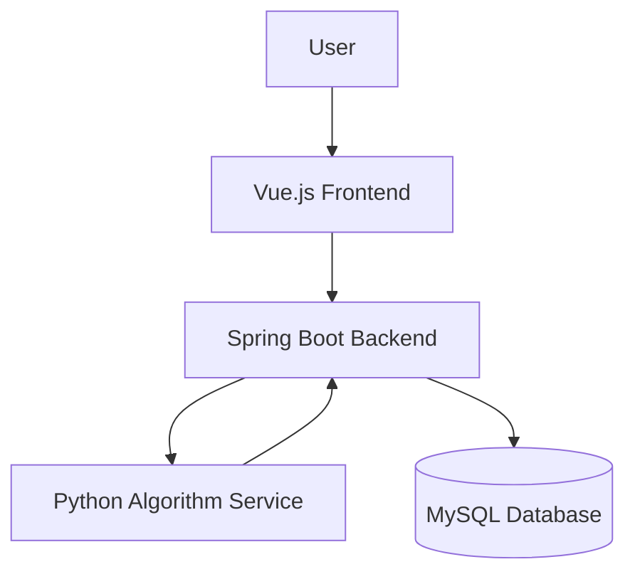
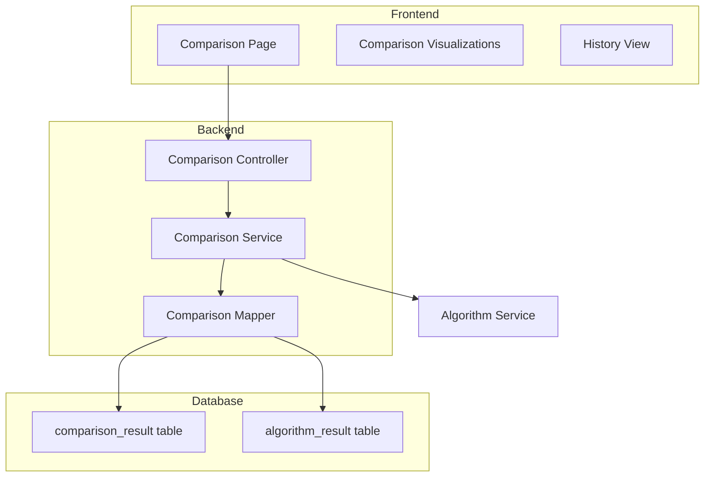
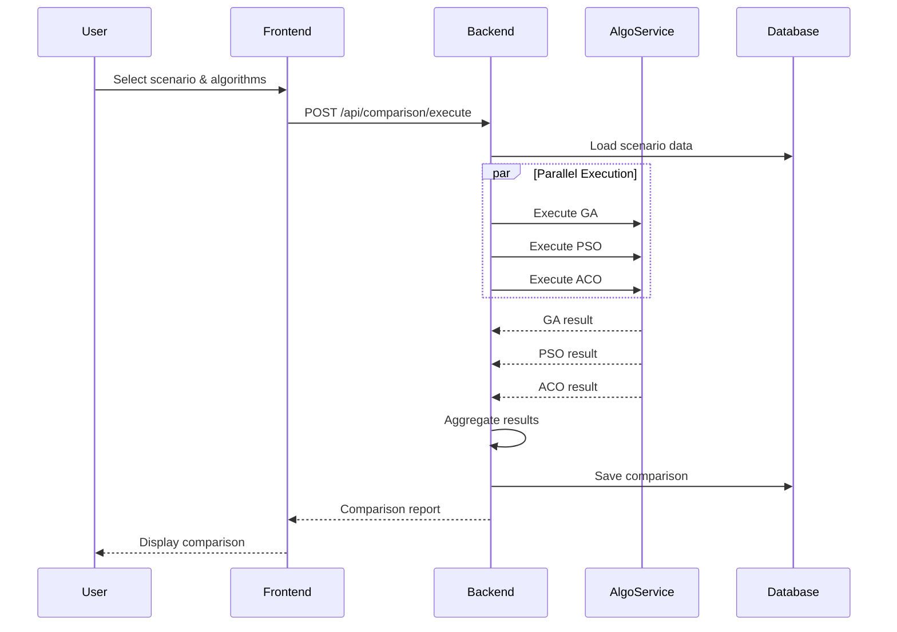
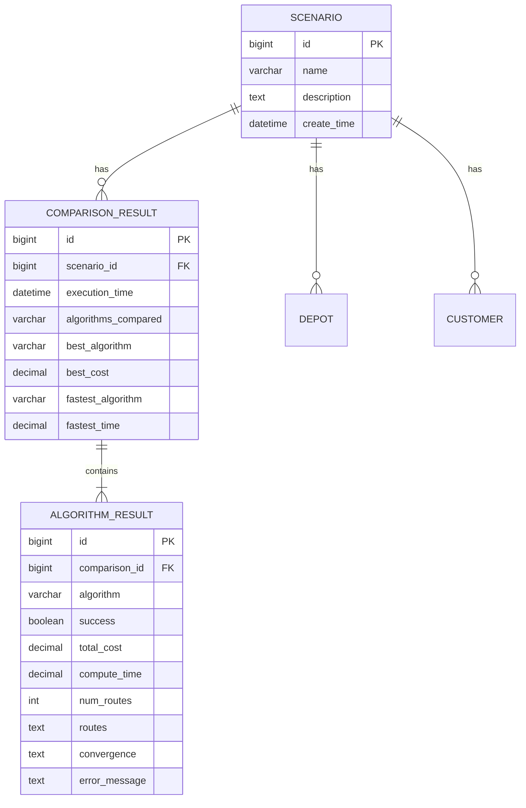

# Algorithm Comparison Feature - Technical Design

## Overview

The algorithm comparison feature enables users to evaluate and compare the performance of multiple MDVRP algorithms (GA, PSO, ACO) on the same scenario. This feature extends the existing MDVRP system by adding a new comparison interface, backend orchestration logic for parallel algorithm execution, and persistent storage for comparison results.

The design follows a three-tier architecture pattern consistent with the existing system:
- **Frontend (Vue.js)**: New comparison page with interactive visualizations
- **Backend (Spring Boot)**: Orchestration service for parallel algorithm execution and result aggregation
- **Algorithm Service (Python Flask)**: Existing service, no modifications required

Key design principles:
- Reuse existing algorithm execution infrastructure
- Maintain data consistency across parallel executions
- Provide comprehensive comparison metrics for informed decision-making
- Support historical comparison tracking for performance analysis over time

## Architecture

### System Context



### Component Architecture



### Execution Flow



## Components and Interfaces

### Frontend Components

#### 1. ComparisonPage.vue
Main page component for algorithm comparison interface.

**Responsibilities:**
- Scenario selection dropdown
- Algorithm selection checkboxes (GA, PSO, ACO)
- Parameter configuration forms
- Execution trigger and progress display
- Result display coordination

**Key Methods:**
```javascript
{
  loadScenarios(): Promise<Scenario[]>
  selectScenario(scenarioId: number): void
  toggleAlgorithm(algorithm: string): void
  executeComparison(): Promise<ComparisonResult>
  displayResults(result: ComparisonResult): void
}
```

#### 2. ComparisonMetricsTable.vue
Tabular display of comparison metrics.

**Props:**
- `results: AlgorithmResult[]` - Array of algorithm results
- `highlightBest: boolean` - Whether to highlight best performers

**Features:**
- Sortable columns (cost, time, routes)
- Best value highlighting
- Percentage difference calculations
- Responsive layout

#### 3. ComparisonCharts.vue
Visual comparison charts component.

**Chart Types:**
- Bar chart: Total cost comparison
- Bar chart: Computation time comparison
- Line chart: Convergence curves (multi-line)
- Radar chart: Multi-dimensional metrics

**Library:** Chart.js or ECharts

#### 4. RouteComparisonView.vue
Side-by-side route visualizations.

**Features:**
- Multiple map instances (one per algorithm)
- Synchronized zoom/pan controls
- Route highlighting on hover
- Toggle visibility per algorithm

#### 5. ComparisonHistory.vue
Historical comparison results browser.

**Features:**
- List of past comparisons with filters
- Date range selection
- Scenario filter
- Click to load historical result

### Backend Components

#### 1. ComparisonController
REST API endpoints for comparison operations.

**Endpoints:**
```java
POST   /api/comparison/execute
  Request: ComparisonRequest
  Response: ComparisonResult
  
GET    /api/comparison/history
  Params: scenarioId (optional), startDate, endDate
  Response: List<ComparisonSummary>
  
GET    /api/comparison/{id}
  Response: ComparisonResult
  
POST   /api/comparison/{id}/export
  Params: format (json|csv)
  Response: File download
```

#### 2. ComparisonService
Business logic for comparison orchestration.

**Key Methods:**
```java
ComparisonResult executeComparison(Long scenarioId, List<String> algorithms, Map<String, Object> params)
ComparisonResult aggregateResults(List<AlgorithmResult> results)
void saveComparison(ComparisonResult result)
List<ComparisonSummary> getHistory(Long scenarioId, LocalDateTime start, LocalDateTime end)
ComparisonResult getById(Long id)
byte[] exportComparison(Long id, ExportFormat format)
```

**Parallel Execution Strategy:**
- Use `CompletableFuture` for asynchronous algorithm execution
- Timeout configuration per algorithm (default: 5 minutes)
- Graceful handling of partial failures
- Result aggregation after all futures complete or timeout

#### 3. AlgorithmExecutor
Wrapper for individual algorithm execution with error handling.

**Responsibilities:**
- Call AlgorithmService for single algorithm
- Measure execution time accurately
- Handle timeouts and errors
- Return standardized AlgorithmResult

### Data Models

#### ComparisonRequest (DTO)
```java
{
  scenarioId: Long
  algorithms: List<String>  // ["GA", "PSO", "ACO"]
  params: Map<String, Map<String, Object>>  // Per-algorithm params
}
```

#### AlgorithmResult (DTO)
```java
{
  algorithm: String
  success: Boolean
  totalCost: Double
  computeTime: Double
  numRoutes: Integer
  routes: List<Route>
  convergence: List<ConvergencePoint>
  error: String  // null if success
}
```

#### ComparisonResult (DTO)
```java
{
  id: Long
  scenarioId: Long
  scenarioName: String
  executionTime: LocalDateTime
  results: List<AlgorithmResult>
  bestCost: AlgorithmResult
  fastestTime: AlgorithmResult
  summary: ComparisonSummary
}
```

#### ComparisonSummary (DTO)
```java
{
  totalAlgorithms: Integer
  successfulAlgorithms: Integer
  failedAlgorithms: Integer
  costRange: CostRange  // min, max, avg
  timeRange: TimeRange  // min, max, avg
}
```

### Database Schema

#### comparison_result Table
```sql
CREATE TABLE comparison_result (
    id BIGINT AUTO_INCREMENT PRIMARY KEY,
    scenario_id BIGINT NOT NULL,
    execution_time DATETIME NOT NULL,
    algorithms_compared VARCHAR(200) NOT NULL COMMENT 'Comma-separated list',
    best_algorithm VARCHAR(50) COMMENT 'Algorithm with lowest cost',
    best_cost DECIMAL(10, 2),
    fastest_algorithm VARCHAR(50),
    fastest_time DECIMAL(10, 3),
    create_time DATETIME DEFAULT CURRENT_TIMESTAMP,
    FOREIGN KEY (scenario_id) REFERENCES scenario(id) ON DELETE CASCADE,
    INDEX idx_scenario_execution (scenario_id, execution_time)
) ENGINE=InnoDB DEFAULT CHARSET=utf8mb4 COMMENT='Algorithm comparison results';
```

#### algorithm_result Table
```sql
CREATE TABLE algorithm_result (
    id BIGINT AUTO_INCREMENT PRIMARY KEY,
    comparison_id BIGINT NOT NULL,
    algorithm VARCHAR(50) NOT NULL,
    success BOOLEAN NOT NULL,
    total_cost DECIMAL(10, 2),
    compute_time DECIMAL(10, 3),
    num_routes INT,
    routes TEXT COMMENT 'JSON format',
    convergence TEXT COMMENT 'JSON format',
    error_message TEXT,
    FOREIGN KEY (comparison_id) REFERENCES comparison_result(id) ON DELETE CASCADE,
    INDEX idx_comparison (comparison_id)
) ENGINE=InnoDB DEFAULT CHARSET=utf8mb4 COMMENT='Individual algorithm results';
```

### API Specifications

#### Execute Comparison
```
POST /api/comparison/execute
Content-Type: application/json

Request:
{
  "scenarioId": 1,
  "algorithms": ["GA", "PSO", "ACO"],
  "params": {
    "GA": {
      "max_iterations": 1000,
      "population_size": 50
    },
    "PSO": {
      "max_iterations": 1000,
      "swarm_size": 30
    },
    "ACO": {
      "max_iterations": 1000,
      "ant_count": 50
    }
  }
}

Response:
{
  "success": true,
  "data": {
    "id": 123,
    "scenarioId": 1,
    "scenarioName": "Test Scenario",
    "executionTime": "2024-03-01T10:30:00",
    "results": [
      {
        "algorithm": "GA",
        "success": true,
        "totalCost": 1250.50,
        "computeTime": 2.345,
        "numRoutes": 5,
        "routes": [...],
        "convergence": [...]
      },
      {
        "algorithm": "PSO",
        "success": true,
        "totalCost": 1180.25,
        "computeTime": 1.890,
        "numRoutes": 4,
        "routes": [...],
        "convergence": [...]
      },
      {
        "algorithm": "ACO",
        "success": false,
        "error": "Timeout after 300 seconds"
      }
    ],
    "summary": {
      "totalAlgorithms": 3,
      "successfulAlgorithms": 2,
      "failedAlgorithms": 1,
      "costRange": {
        "min": 1180.25,
        "max": 1250.50,
        "avg": 1215.38
      },
      "timeRange": {
        "min": 1.890,
        "max": 2.345,
        "avg": 2.118
      }
    }
  }
}
```

## Data Models

### Entity Relationships



### Data Flow

1. **Input Data**: Scenario ID + Algorithm selections → Backend
2. **Scenario Loading**: Backend loads depots and customers from database
3. **Parallel Execution**: Backend sends identical scenario data to Algorithm Service for each selected algorithm
4. **Result Collection**: Backend collects results (or errors) from each execution
5. **Aggregation**: Backend computes summary statistics and identifies best performers
6. **Persistence**: Backend saves comparison_result and algorithm_result records
7. **Response**: Backend returns complete comparison data to frontend


## Correctness Properties

*A property is a characteristic or behavior that should hold true across all valid executions of a system—essentially, a formal statement about what the system should do. Properties serve as the bridge between human-readable specifications and machine-verifiable correctness guarantees.*

### Property 1: Scenario Selection Loads Complete Data

*For any* scenario in the system, when a user selects that scenario, the system SHALL load and display all associated depot and customer information including counts and total demand.

**Validates: Requirements 1.2, 1.3**

### Property 2: Algorithm Selection Validation

*For any* algorithm selection state with fewer than two algorithms selected, the comparison execution button SHALL be disabled.

**Validates: Requirements 2.3**

### Property 3: Identical Input Data Distribution

*For any* comparison execution with multiple selected algorithms, all algorithms SHALL receive identical scenario data (same depot coordinates, capacities, customer locations, and demands).

**Validates: Requirements 3.1, 3.2**

### Property 4: Execution Time Recording

*For any* algorithm execution within a comparison, the system SHALL record both start and end timestamps, and the computed duration SHALL equal the difference between these timestamps.

**Validates: Requirements 3.4**

### Property 5: Fault Isolation

*For any* comparison execution where one algorithm fails, all other selected algorithms SHALL continue execution and produce results independently.

**Validates: Requirements 3.5**

### Property 6: Result Aggregation Completeness

*For any* set of algorithm execution results (successful or failed), the system SHALL aggregate them into a Comparison_Report containing all individual results and computed summary statistics.

**Validates: Requirements 3.6**

### Property 7: Best Performer Identification

*For any* comparison result with at least one successful algorithm execution, the system SHALL correctly identify and highlight the algorithm with the lowest total cost and the algorithm with the shortest computation time.

**Validates: Requirements 4.2, 5.2**

### Property 8: Cost Difference Calculation

*For any* comparison result with multiple successful algorithms, the system SHALL calculate cost differences relative to the best solution as both absolute values (best_cost - other_cost) and percentages ((other_cost - best_cost) / best_cost * 100).

**Validates: Requirements 4.3**

### Property 9: Time Precision Formatting

*For any* computation time value in a comparison result, the displayed value SHALL be formatted to exactly three decimal places.

**Validates: Requirements 5.5**

### Property 10: Route Metrics Calculation

*For any* algorithm result containing routes, the system SHALL correctly calculate the number of routes, average route cost (sum of route costs / number of routes), and maximum route cost.

**Validates: Requirements 6.1, 6.2, 6.3**

### Property 11: Failed Algorithm Display

*For any* algorithm execution that fails, the comparison display SHALL show an error indicator (such as "N/A" or error message) instead of numeric metrics for that algorithm.

**Validates: Requirements 4.5, 11.4**

### Property 12: Convergence Data Conditional Rendering

*For any* algorithm result, if convergence data is present, it SHALL be included in the convergence chart; if convergence data is absent, that algorithm SHALL be excluded from the convergence chart.

**Validates: Requirements 8.1, 8.5**

### Property 13: Export Format Support

*For any* comparison result, the system SHALL support exporting the data in both JSON and CSV formats, with each export containing all comparison metrics, scenario information, and execution timestamp.

**Validates: Requirements 9.2, 9.3, 9.4, 9.5**

### Property 14: Export Completeness

*For any* exported comparison file, the file SHALL contain all algorithm results (routes, costs, times, convergence data), scenario metadata (ID, name, depot/customer counts), and execution timestamp.

**Validates: Requirements 9.4, 9.5**

### Property 15: Comparison Persistence

*For any* completed comparison execution, the system SHALL save a complete Comparison_Report to the database including scenario ID, algorithm list, execution timestamp, and all individual algorithm results.

**Validates: Requirements 10.1, 10.2**

### Property 16: Historical Comparison Retrieval

*For any* saved comparison in the database, when a user selects that comparison from the history view, the system SHALL load and display the complete saved results including all metrics and visualizations.

**Validates: Requirements 10.5**

### Property 17: Timeout Error Handling

*For any* algorithm execution that exceeds the configured timeout threshold, the system SHALL record a timeout error for that specific algorithm and continue with remaining algorithms.

**Validates: Requirements 11.2**

### Property 18: Invalid Data Error Handling

*For any* algorithm execution that returns data failing validation (missing required fields, invalid data types, or constraint violations), the system SHALL record a validation error for that algorithm.

**Validates: Requirements 11.3**

### Property 19: Responsive Layout Adaptation

*For any* screen width below the side-by-side threshold (typically 768px), the comparison page SHALL stack route visualizations vertically instead of horizontally.

**Validates: Requirements 12.4**

### Property 20: Comparison Result Round-Trip

*For any* comparison result that is saved to the database and then retrieved, the retrieved data SHALL be equivalent to the original result (same costs, times, routes, and metadata).

**Pattern: Round-trip property for data persistence**

**Validates: Requirements 10.1, 10.2, 10.5**

## Error Handling

### Error Categories

#### 1. Algorithm Service Errors
- **Service Unavailable**: Algorithm service is not reachable
  - Response: HTTP 503, error message to user, suggestion to check service status
  - Behavior: All algorithm executions fail immediately
  
- **Service Timeout**: Algorithm service doesn't respond within timeout
  - Response: Timeout error for affected algorithm, continue with others
  - Timeout: Configurable, default 300 seconds (5 minutes)

#### 2. Algorithm Execution Errors
- **Algorithm Timeout**: Individual algorithm exceeds execution time limit
  - Response: Mark algorithm as failed with timeout error, continue with others
  - Behavior: Partial results displayed
  
- **Algorithm Failure**: Algorithm returns error response
  - Response: Display error message from algorithm service
  - Behavior: Continue with remaining algorithms
  
- **Invalid Result**: Algorithm returns malformed or invalid data
  - Response: Validation error, mark algorithm as failed
  - Validation: Check for required fields (routes, totalCost, computeTime)

#### 3. Data Errors
- **Scenario Not Found**: Selected scenario doesn't exist
  - Response: HTTP 404, error message to user
  - Behavior: Prevent comparison execution
  
- **Empty Scenario**: Scenario has no depots or customers
  - Response: Validation error, prevent execution
  - Message: "Scenario must have at least one depot and one customer"
  
- **Invalid Algorithm Selection**: Unknown algorithm name
  - Response: HTTP 400, list of valid algorithms
  - Behavior: Reject request

#### 4. Database Errors
- **Save Failure**: Cannot save comparison result
  - Response: Log error, return results to user anyway
  - Behavior: Comparison executes successfully but history not saved
  - User Message: "Results displayed but not saved to history"
  
- **Retrieval Failure**: Cannot load historical comparison
  - Response: HTTP 500, error message
  - Behavior: Display error in history view

### Error Response Format

```json
{
  "success": false,
  "error": "Error category",
  "message": "Detailed error message",
  "suggestion": "Actionable suggestion for user",
  "partialResults": {
    "available": true,
    "results": [...]
  }
}
```

### Partial Success Handling

When some algorithms succeed and others fail:
1. Display successful results normally
2. Show error indicators for failed algorithms
3. Calculate summary statistics using only successful results
4. Include failure information in comparison report
5. Save partial results to database with failure details

### Retry Strategy

- **Algorithm Service Connection**: 3 retries with 2-second backoff
- **Individual Algorithm Execution**: No automatic retry (user can re-run)
- **Database Operations**: 2 retries with 1-second backoff

## Testing Strategy

### Dual Testing Approach

This feature requires both unit testing and property-based testing for comprehensive coverage:

- **Unit Tests**: Verify specific examples, edge cases, and integration points
- **Property Tests**: Verify universal properties across all inputs using randomized test data

### Unit Testing Focus

Unit tests should cover:

1. **Specific Examples**
   - Comparison with 2 algorithms (GA + PSO)
   - Comparison with all 3 algorithms (GA + PSO + ACO)
   - Empty scenario list handling
   - Single algorithm selection (button disabled)

2. **Edge Cases**
   - All algorithms fail
   - All algorithms succeed
   - Mixed success/failure scenarios
   - Scenario with single depot and single customer
   - Scenario with maximum supported size

3. **Integration Points**
   - Backend to Algorithm Service communication
   - Database save and retrieve operations
   - Export file generation (JSON and CSV)
   - Frontend API calls to backend

4. **Error Conditions**
   - Algorithm service unavailable
   - Database connection failure
   - Invalid scenario ID
   - Malformed algorithm response

### Property-Based Testing Configuration

**Testing Library**: 
- Java: jqwik (for backend)
- JavaScript: fast-check (for frontend)

**Configuration**:
- Minimum 100 iterations per property test
- Timeout: 60 seconds per test
- Shrinking enabled for failure case minimization

**Test Tagging Format**:
Each property test must include a comment referencing the design property:
```java
// Feature: algorithm-comparison, Property 3: Identical Input Data Distribution
```

### Property Test Implementation Guidelines

#### Property 1: Scenario Selection Loads Complete Data
```java
@Property
// Feature: algorithm-comparison, Property 1: Scenario Selection Loads Complete Data
void scenarioSelectionLoadsCompleteData(
    @ForAll("scenarios") Scenario scenario
) {
    // Generate random scenario with depots and customers
    // Select scenario in UI/API
    // Verify all depot and customer data is loaded
    // Verify counts and totals are correct
}
```

#### Property 3: Identical Input Data Distribution
```java
@Property
// Feature: algorithm-comparison, Property 3: Identical Input Data Distribution
void identicalInputDataDistribution(
    @ForAll("scenarios") Scenario scenario,
    @ForAll("algorithmSets") Set<String> algorithms
) {
    // Assume: algorithms.size() >= 2
    // Execute comparison
    // Capture input data sent to each algorithm
    // Verify all algorithms received identical data
}
```

#### Property 8: Cost Difference Calculation
```java
@Property
// Feature: algorithm-comparison, Property 8: Cost Difference Calculation
void costDifferenceCalculation(
    @ForAll("algorithmResults") List<AlgorithmResult> results
) {
    // Assume: results.size() >= 2, all successful
    // Calculate differences
    // Verify absolute difference = other_cost - best_cost
    // Verify percentage = (other_cost - best_cost) / best_cost * 100
}
```

#### Property 20: Comparison Result Round-Trip
```java
@Property
// Feature: algorithm-comparison, Property 20: Comparison Result Round-Trip
void comparisonResultRoundTrip(
    @ForAll("comparisonResults") ComparisonResult original
) {
    // Save comparison to database
    // Retrieve comparison by ID
    // Verify retrieved equals original (costs, times, routes, metadata)
}
```

### Test Data Generators

Property tests require generators for:

1. **Scenario Generator**
   - Random number of depots (1-5)
   - Random number of customers (5-50)
   - Random coordinates within bounds
   - Random demands and capacities

2. **Algorithm Result Generator**
   - Random algorithm name from [GA, PSO, ACO]
   - Random success/failure status
   - Random cost values (100-10000)
   - Random computation times (0.1-300 seconds)
   - Random route structures

3. **Comparison Result Generator**
   - Random scenario
   - Random algorithm set (2-3 algorithms)
   - Random execution timestamp
   - Generated algorithm results

### Coverage Goals

- **Line Coverage**: ≥ 80%
- **Branch Coverage**: ≥ 75%
- **Property Coverage**: 100% (all 20 properties tested)
- **Integration Coverage**: All API endpoints tested

### Test Execution

**Unit Tests**:
```bash
# Backend
mvn test

# Frontend
npm run test:unit
```

**Property Tests**:
```bash
# Backend (jqwik)
mvn test -Dtest=*PropertyTest

# Frontend (fast-check)
npm run test:property
```

**Integration Tests**:
```bash
# End-to-end comparison flow
npm run test:e2e
```

### Continuous Integration

All tests (unit + property) must pass before merge:
- Run on every pull request
- Run on main branch after merge
- Property tests run with 100 iterations in CI
- Timeout: 10 minutes for full test suite
