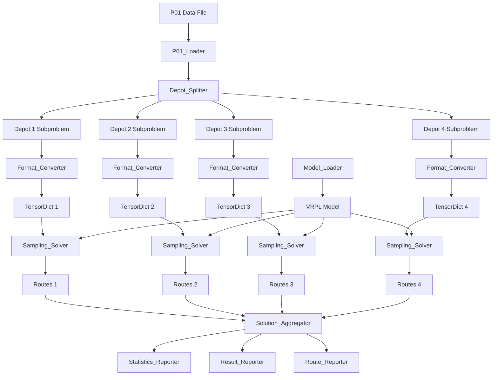

# Design Document: P01 RouteFinder Sampling

## Overview

本设计文档描述了P01 RouteFinder采样功能的技术实现方案。该功能将Cordeau格式的MDVRP实例(P01)分解为多个单仓库CVRP子问题,使用RouteFinder预训练的VRPL模型进行多次采样求解,并输出详细的统计结果和最优解路径信息。

### 核心目标

1. 加载并解析Cordeau格式的P01 MDVRP实例
2. 将MDVRP分解为多个单仓库CVRP子问题
3. 使用RouteFinder VRPL预训练模型对每个子问题进行采样求解
4. 聚合所有子问题的解,计算总成本和Gap
5. 输出详细的统计信息和最优解路径

### 技术栈

- Python 3.10+
- PyTorch 2.0+
- TorchRL (with compatibility patches)
- RL4CO framework
- RouteFinder VRPL模型
- NumPy for numerical computations

### 关键约束

- 使用欧几里得距离计算(符合Cordeau规范)
- 不包含服务时间在成本计算中
- 使用fix_checkpoint_loader.py处理模型加载兼容性
- Checkpoint路径: `routefinder/checkpoints/50/pomo-vrpl.ckpt`
- P01 BKS: 576.87

## Architecture

### 系统架构图



### 数据流

1. **输入阶段**: P01数据文件 → 结构化数据
2. **分解阶段**: MDVRP实例 → 多个CVRP子问题
3. **转换阶段**: CVRP子问题 → TensorDict格式
4. **求解阶段**: TensorDict → 采样解 → 最优解
5. **聚合阶段**: 多个子问题解 → 完整MDVRP解
6. **输出阶段**: 解数据 → 统计信息 + 路径详情

### 模块职责

- **P01_Loader**: 解析Cordeau格式文件,提取所有数据
- **Depot_Splitter**: 将客户分配到最近的仓库
- **Format_Converter**: 将CVRP子问题转换为RouteFinder TensorDict格式
- **Model_Loader**: 加载VRPL预训练模型(应用兼容性补丁)
- **Sampling_Solver**: 执行多次采样求解,选择最优解
- **Route_Decoder**: 将模型actions解码为路径列表
- **Cost_Calculator**: 计算路径的欧几里得距离成本
- **Solution_Aggregator**: 聚合所有仓库的解
- **Statistics_Reporter**: 输出采样统计信息
- **Result_Reporter**: 输出最终结果和Gap
- **Route_Reporter**: 输出最优解的路径详情

## Components and Interfaces

### 1. P01_Loader

**职责**: 加载并解析Cordeau格式的P01数据文件

**接口**:
```python
class P01Loader:
    @staticmethod
    def load_instance(filepath: str) -> Dict[str, Any]:
        """
        加载P01实例
        
        Args:
            filepath: P01数据文件路径
            
        Returns:
            {
                'n_customers': int,
                'n_depots': int,
                'n_vehicles': int,
                'customers': List[Dict],  # [{'id', 'x', 'y', 'demand'}, ...]
                'depots': List[Dict],     # [{'id', 'x', 'y'}, ...]
                'depots_info': List[Dict] # [{'capacity', 'max_distance'}, ...]
            }
        """
```

**实现要点**:
- 解析第1行获取问题规模(type, m, n, t)
- 解析第2到t+1行获取车辆约束(D, Q)
- 解析客户节点(前n个节点)
- 解析仓库节点(最后t个节点)
- 客户编号从1开始,仓库编号从n+1开始

### 2. Depot_Splitter

**职责**: 将客户分配到最近的仓库

**接口**:
```python
class DepotSplitter:
    @staticmethod
    def assign_customers_to_nearest_depot(
        customers: List[Dict],
        depots: List[Dict]
    ) -> Dict[int, List[Dict]]:
        """
        将客户分配到最近的仓库
        
        Args:
            customers: 客户列表
            depots: 仓库列表
            
        Returns:
            {depot_id: [customer1, customer2, ...], ...}
        """
    
    @staticmethod
    def euclidean_distance(x1: float, y1: float, x2: float, y2: float) -> float:
        """计算欧几里得距离"""
```

**实现要点**:
- 对每个客户,计算到所有仓库的欧几里得距离
- 选择距离最小的仓库进行分配
- 返回每个仓库对应的客户列表
- 输出每个仓库分配到的客户数量

### 3. Format_Converter

**职责**: 将CVRP子问题转换为RouteFinder TensorDict格式

**接口**:
```python
class FormatConverter:
    @staticmethod
    def convert_to_tensordict(
        depot: Dict,
        customers: List[Dict],
        capacity: float,
        max_distance: float
    ) -> TensorDict:
        """
        转换为TensorDict格式
        
        Args:
            depot: 仓库信息 {'x', 'y'}
            customers: 客户列表 [{'x', 'y', 'demand'}, ...]
            capacity: 车辆容量
            max_distance: 最大距离限制
            
        Returns:
            TensorDict with fields:
                - locs: [1+n_customers, 2] (depot + customers coordinates)
                - demand: [1+n_customers] (0 for depot, actual for customers)
                - capacity: [1]
                - distance_limit: [1]
                - batch_size: []
        """
```

**实现要点**:
- 创建位置张量: [depot_coord, customer1_coord, customer2_coord, ...]
- 创建需求张量: [0, demand1, demand2, ...]
- 添加容量和距离限制
- 添加batch维度(batch_size=1)
- 参考RouteFinder_VRPL_使用指南.md中的格式

### 4. Model_Loader

**职责**: 加载RouteFinder VRPL预训练模型

**接口**:
```python
class ModelLoader:
    @staticmethod
    def load_vrpl_model(checkpoint_path: str, device: str = 'auto') -> torch.nn.Module:
        """
        加载VRPL模型
        
        Args:
            checkpoint_path: checkpoint文件路径
            device: 'auto', 'cuda', or 'cpu'
            
        Returns:
            加载的模型(已设置为eval模式)
            
        Raises:
            FileNotFoundError: checkpoint文件不存在
        """
```

**实现要点**:
- 使用fix_checkpoint_loader.py的load_checkpoint_compatible()函数
- 应用TorchRL兼容性补丁
- 设置模型为评估模式(model.eval())
- 自动检测可用设备(GPU优先)
- 如果文件不存在,列出可用的checkpoint文件

### 5. Sampling_Solver

**职责**: 执行多次采样求解,选择最优解

**接口**:
```python
class SamplingSolver:
    def __init__(self, model: torch.nn.Module, num_samples: int = 10):
        """
        初始化采样求解器
        
        Args:
            model: VRPL模型
            num_samples: 采样次数
        """
    
    def solve(self, td: TensorDict, depot_id: int) -> Dict[str, Any]:
        """
        求解单个CVRP子问题
        
        Args:
            td: TensorDict格式的实例
            depot_id: 仓库编号
            
        Returns:
            {
                'routes': List[Dict],  # 最优解的路径列表
                'cost': float,         # 最优成本
                'all_costs': List[float],  # 所有样本的成本
                'best_sample_idx': int     # 最优样本索引
            }
        """
```

**实现要点**:
- 执行指定次数的采样
- 每次采样使用decode_type="sampling"
- 解码actions为路径列表
- 计算每个样本的成本
- 选择成本最低的样本作为最优解
- 记录所有样本的成本用于统计

### 6. Route_Decoder

**职责**: 将模型actions解码为路径列表

**接口**:
```python
class RouteDecoder:
    @staticmethod
    def decode_actions(
        actions: torch.Tensor,
        depot_id: int
    ) -> List[Dict[str, Any]]:
        """
        解码actions为路径列表
        
        Args:
            actions: 模型输出的actions张量 [batch, seq_len]
            depot_id: 仓库编号
            
        Returns:
            [
                {
                    'depot_id': int,
                    'customers': List[int],  # 客户ID列表
                    'depot': int             # 仓库ID
                },
                ...
            ]
        """
```

**实现要点**:
- 将actions张量转换为numpy数组
- action值为0表示返回仓库,结束当前路径
- action值大于0表示访问客户,添加到当前路径
- 每条路径包含depot_id、customers列表和depot信息

### 7. Cost_Calculator

**职责**: 计算路径的欧几里得距离成本

**接口**:
```python
class CostCalculator:
    @staticmethod
    def calculate_route_cost(
        route: Dict[str, Any],
        nodes: Dict[int, Dict[str, float]]
    ) -> float:
        """
        计算单条路径的成本
        
        Args:
            route: 路径信息 {'depot_id', 'customers', 'depot'}
            nodes: 所有节点的坐标 {node_id: {'x', 'y'}, ...}
            
        Returns:
            路径总距离(不包含服务时间)
        """
    
    @staticmethod
    def calculate_solution_cost(routes: List[Dict]) -> float:
        """计算解的总成本"""
```

**实现要点**:
- 计算仓库到第一个客户的距离
- 计算相邻客户之间的距离
- 计算最后一个客户返回仓库的距离
- 使用欧几里得距离公式: sqrt((x1-x2)^2 + (y1-y2)^2)
- 不包含服务时间

### 8. Solution_Aggregator

**职责**: 聚合所有仓库的解

**接口**:
```python
class SolutionAggregator:
    @staticmethod
    def aggregate_solutions(
        depot_solutions: Dict[int, Dict[str, Any]]
    ) -> Dict[str, Any]:
        """
        聚合所有仓库的解
        
        Args:
            depot_solutions: {depot_id: solution, ...}
            
        Returns:
            {
                'routes': List[Dict],      # 所有路径
                'total_cost': float,       # 总成本
                'depot_costs': Dict[int, float],  # 每个仓库的成本
                'n_routes': int            # 总路径数
            }
        """
```

### 9. Statistics_Reporter

**职责**: 输出采样统计信息

**接口**:
```python
class StatisticsReporter:
    @staticmethod
    def report_sampling_statistics(
        all_costs: List[float],
        depot_id: int
    ) -> None:
        """
        输出采样统计信息
        
        Args:
            all_costs: 所有样本的成本列表
            depot_id: 仓库编号
        """
```

**输出内容**:
- 最优成本(最小值)
- 最差成本(最大值)
- 平均成本
- 成本标准差
- 每个样本的成本和是否为新最优

### 10. Result_Reporter

**职责**: 输出最终结果和Gap

**接口**:
```python
class ResultReporter:
    @staticmethod
    def report_final_results(
        solution: Dict[str, Any],
        bks: float,
        total_time: float,
        num_samples: int
    ) -> None:
        """
        输出最终结果
        
        Args:
            solution: 完整解
            bks: Best Known Solution
            total_time: 总求解时间
            num_samples: 采样次数
        """
```

**输出内容**:
- 总路径数
- 最优成本
- BKS值(576.87 for P01)
- Gap百分比
- 总求解时间和平均每样本时间
- 解质量评价(优秀/良好/一般/较差)
- 负Gap警告(如果适用)

### 11. Route_Reporter

**职责**: 输出最优解的路径详情

**接口**:
```python
class RouteReporter:
    @staticmethod
    def report_routes(solution: Dict[str, Any]) -> None:
        """
        输出路径详情
        
        Args:
            solution: 完整解
        """
```

**输出内容**:
- 按仓库分组显示路径
- 每条路径的仓库编号
- 每条路径访问的客户ID列表

## Data Models

### CordeauInstance

```python
@dataclass
class CordeauInstance:
    """Cordeau MDVRP实例数据模型"""
    n_customers: int
    n_depots: int
    n_vehicles: int
    customers: List[Customer]
    depots: List[Depot]
    depots_info: List[DepotInfo]
```

### Customer

```python
@dataclass
class Customer:
    """客户节点数据模型"""
    id: int
    x: float
    y: float
    demand: float
    service_time: float = 0.0
```

### Depot

```python
@dataclass
class Depot:
    """仓库节点数据模型"""
    id: int
    x: float
    y: float
```

### DepotInfo

```python
@dataclass
class DepotInfo:
    """仓库约束信息数据模型"""
    capacity: float
    max_distance: float
```

### Route

```python
@dataclass
class Route:
    """路径数据模型"""
    depot_id: int
    customers: List[int]
    cost: float
```

### Solution

```python
@dataclass
class Solution:
    """解数据模型"""
    routes: List[Route]
    total_cost: float
    depot_costs: Dict[int, float]
    n_routes: int
```

### SamplingSolution

```python
@dataclass
class SamplingSolution:
    """采样求解结果数据模型"""
    routes: List[Route]
    cost: float
    all_costs: List[float]
    best_sample_idx: int
```

## Correctness Properties

*A property is a characteristic or behavior that should hold true across all valid executions of a system-essentially, a formal statement about what the system should do. Properties serve as the bridge between human-readable specifications and machine-verifiable correctness guarantees.*

### Property 1: Cordeau格式解析保持数据完整性

*For any* valid Cordeau format file, parsing and then reconstructing the data should preserve all customer coordinates, demands, depot coordinates, and constraints.

**Validates: Requirements 1.1, 1.2, 1.3, 1.4, 1.5**

### Property 2: 客户分配到最近仓库

*For any* customer and set of depots, the assigned depot should be the one with minimum Euclidean distance to that customer.

**Validates: Requirements 2.1, 2.2, 2.3**

### Property 3: 格式转换创建有效TensorDict

*For any* CVRP subproblem, the converted TensorDict should have correct shape (depot + customers), depot demand of 0, customer demands matching input, and batch dimension of 1.

**Validates: Requirements 3.1, 3.2, 3.3, 3.4**

### Property 4: 路径成本使用欧几里得距离

*For any* route with depot and customer coordinates, the calculated cost should equal the sum of Euclidean distances between consecutive nodes, without including service time.

**Validates: Requirements 7.1, 7.2, 7.3, 7.4**

### Property 5: 采样选择最小成本解

*For any* set of sampling results, the selected solution should have the minimum cost among all samples.

**Validates: Requirements 5.5, 5.6**

### Property 6: Action解码产生有效路径

*For any* action sequence, decoding should produce routes where action 0 ends the current route and positive actions are added as customers to the current route.

**Validates: Requirements 6.2, 6.3, 6.4**

### Property 7: 统计计算正确性

*For any* list of sample costs, the reported minimum should be the actual minimum, maximum should be the actual maximum, mean should equal sum/count, and standard deviation should match the statistical formula.

**Validates: Requirements 8.1, 8.2, 8.3, 8.4**

### Property 8: Gap计算公式正确性

*For any* algorithm cost and BKS value, the Gap should equal ((algorithm_cost - BKS) / BKS) * 100.

**Validates: Requirements 9.4**

### Property 9: 时间计算正确性

*For any* total solving time and number of samples, the average time per sample should equal total_time / num_samples.

**Validates: Requirements 9.5**

## Error Handling

### 文件加载错误

**场景**: P01数据文件不存在或格式错误

**处理**:
- 捕获FileNotFoundError
- 输出清晰的错误信息,包含文件路径
- 建议检查文件路径和格式
- 返回非零退出码

### 模型加载错误

**场景**: Checkpoint文件不存在或加载失败

**处理**:
- 捕获FileNotFoundError
- 列出可用的checkpoint文件
- 输出详细错误信息和堆栈跟踪
- 建议检查checkpoint路径和兼容性
- 返回非零退出码

### 求解过程异常

**场景**: 模型推理或路径解码过程中发生异常

**处理**:
- 捕获所有异常
- 输出详细错误信息和堆栈跟踪
- 记录当前处理的仓库和样本编号
- 尝试继续处理其他仓库(如果可能)
- 返回非零退出码

### 负Gap警告

**场景**: 计算的Gap小于0(算法成本 < BKS)

**处理**:
- 输出警告信息
- 提示可能的错误原因:
  - 约束违反(容量或距离)
  - 距离计算错误
  - BKS读取错误
  - 节点编号混淆
- 建议运行约束验证
- 不中断执行,继续输出结果

### 内存不足

**场景**: 大规模采样导致内存不足

**处理**:
- 捕获MemoryError
- 建议减少采样次数
- 建议使用CPU而非GPU(如果适用)
- 返回非零退出码

## Testing Strategy

### 单元测试

使用pytest框架进行单元测试,覆盖以下模块:

1. **P01_Loader测试**
   - 测试正确解析Cordeau格式文件
   - 测试提取问题规模参数
   - 测试提取客户和仓库数据
   - 测试文件不存在的错误处理

2. **Depot_Splitter测试**
   - 测试欧几里得距离计算
   - 测试客户分配到最近仓库
   - 测试返回数据结构

3. **Format_Converter测试**
   - 测试TensorDict创建
   - 测试张量形状和值
   - 测试batch维度

4. **Model_Loader测试**
   - 测试模型加载成功
   - 测试兼容性补丁应用
   - 测试设备选择
   - 测试文件不存在的错误处理

5. **Route_Decoder测试**
   - 测试action解码逻辑
   - 测试路径结束标记(action=0)
   - 测试客户添加(action>0)

6. **Cost_Calculator测试**
   - 测试单条路径成本计算
   - 测试欧几里得距离公式
   - 测试不包含服务时间

7. **Statistics_Reporter测试**
   - 测试最小值、最大值计算
   - 测试平均值、标准差计算

8. **Result_Reporter测试**
   - 测试Gap计算公式
   - 测试时间计算
   - 测试解质量评价逻辑
   - 测试负Gap警告

### 属性测试

使用Hypothesis框架进行属性测试,每个测试运行最少100次迭代:

1. **Property 1: Cordeau格式解析保持数据完整性**
   ```python
   @given(cordeau_instance())
   def test_parsing_preserves_data(instance):
       """Feature: p01-routefinder-sampling, Property 1: Cordeau格式解析保持数据完整性"""
       # 生成随机Cordeau格式数据
       # 解析数据
       # 验证所有数据被正确提取
   ```

2. **Property 2: 客户分配到最近仓库**
   ```python
   @given(customers=st.lists(customer()), depots=st.lists(depot(), min_size=1))
   def test_customer_assigned_to_nearest_depot(customers, depots):
       """Feature: p01-routefinder-sampling, Property 2: 客户分配到最近仓库"""
       # 执行分配
       # 验证每个客户分配到最近的仓库
   ```

3. **Property 3: 格式转换创建有效TensorDict**
   ```python
   @given(depot=depot(), customers=st.lists(customer()), capacity=st.floats(min_value=1), max_distance=st.floats(min_value=0))
   def test_format_conversion_creates_valid_tensordict(depot, customers, capacity, max_distance):
       """Feature: p01-routefinder-sampling, Property 3: 格式转换创建有效TensorDict"""
       # 执行转换
       # 验证TensorDict结构和值
   ```

4. **Property 4: 路径成本使用欧几里得距离**
   ```python
   @given(route=route_with_coordinates())
   def test_route_cost_uses_euclidean_distance(route):
       """Feature: p01-routefinder-sampling, Property 4: 路径成本使用欧几里得距离"""
       # 计算路径成本
       # 手动计算欧几里得距离总和
       # 验证两者相等
   ```

5. **Property 5: 采样选择最小成本解**
   ```python
   @given(sample_costs=st.lists(st.floats(min_value=0), min_size=1))
   def test_sampling_selects_minimum_cost(sample_costs):
       """Feature: p01-routefinder-sampling, Property 5: 采样选择最小成本解"""
       # 执行采样求解
       # 验证选择的解具有最小成本
   ```

6. **Property 6: Action解码产生有效路径**
   ```python
   @given(actions=st.lists(st.integers(min_value=0)))
   def test_action_decoding_produces_valid_routes(actions):
       """Feature: p01-routefinder-sampling, Property 6: Action解码产生有效路径"""
       # 解码actions
       # 验证路径结构有效
       # 验证0结束路径,正值添加客户
   ```

7. **Property 7: 统计计算正确性**
   ```python
   @given(costs=st.lists(st.floats(min_value=0), min_size=1))
   def test_statistics_calculations_correct(costs):
       """Feature: p01-routefinder-sampling, Property 7: 统计计算正确性"""
       # 计算统计信息
       # 验证min, max, mean, std正确
   ```

8. **Property 8: Gap计算公式正确性**
   ```python
   @given(algorithm_cost=st.floats(min_value=0), bks=st.floats(min_value=0.1))
   def test_gap_calculation_correct(algorithm_cost, bks):
       """Feature: p01-routefinder-sampling, Property 8: Gap计算公式正确性"""
       # 计算Gap
       # 验证公式: ((algorithm_cost - bks) / bks) * 100
   ```

9. **Property 9: 时间计算正确性**
   ```python
   @given(total_time=st.floats(min_value=0), num_samples=st.integers(min_value=1))
   def test_timing_calculation_correct(total_time, num_samples):
       """Feature: p01-routefinder-sampling, Property 9: 时间计算正确性"""
       # 计算平均时间
       # 验证: avg_time = total_time / num_samples
   ```

### 集成测试

1. **完整流程测试**
   - 使用真实的P01数据文件
   - 执行完整的求解流程
   - 验证输出结果的正确性
   - 验证Gap在合理范围内

2. **模型加载测试**
   - 测试使用真实checkpoint文件加载模型
   - 验证兼容性补丁正确应用
   - 验证模型可以正常推理

3. **多仓库求解测试**
   - 测试所有4个仓库都被正确处理
   - 验证解被正确聚合
   - 验证总成本计算正确

### 性能测试

1. **采样速度测试**
   - 测试不同采样次数的执行时间
   - 验证GPU加速效果(如果可用)
   - 对比PSO和GA算法的速度

2. **内存使用测试**
   - 测试大规模采样的内存占用
   - 验证没有内存泄漏

### 测试配置

- 最小测试覆盖率: 80%
- 属性测试迭代次数: 100次
- 使用pytest-cov生成覆盖率报告
- 使用pytest-benchmark进行性能测试