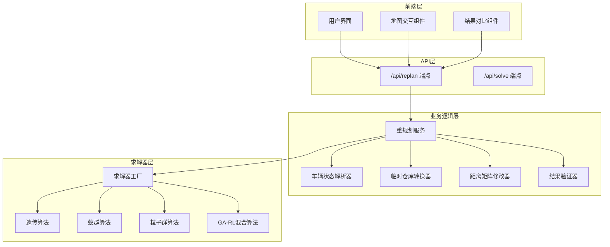
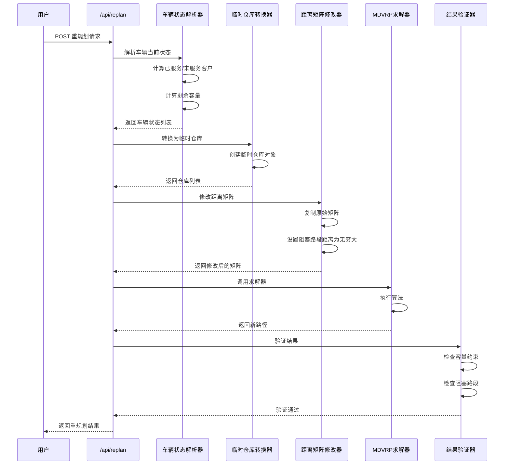

# 设计文档：道路阻塞动态重规划

## 概述

本设计文档描述了MDVRP系统中道路阻塞动态重规划功能的技术实现方案。该功能允许调度员在车辆执行配送任务过程中，当遇到道路阻塞时，快速生成新的路径规划方案。

核心设计思路是将车辆当前位置转换为临时仓库，修改距离矩阵以反映道路阻塞状态，然后使用现有的MDVRP求解器对未完成的配送任务进行重新规划。

## 架构

### 系统架构图



### 数据流图



## 组件和接口

### 1. API端点设计

#### 1.1 `/api/replan` 端点

**HTTP方法**: POST

**请求格式**:
```json
{
  "depots": [
    {
      "id": 1,
      "x": 0.0,
      "y": 0.0,
      "vehicles": 5,
      "capacity": 100
    }
  ],
  "customers": [
    {
      "id": 1,
      "x": 10.0,
      "y": 20.0,
      "demand": 15
    }
  ],
  "routes": [
    {
      "vehicleId": 1,
      "depotId": 1,
      "path": [1, 3, 5, 7],
      "cost": 150.5
    }
  ],
  "blocked_edges": [
    {
      "from": 1,
      "to": 3
    }
  ],
  "vehicle_positions": {
    "1": 3
  },
  "algorithm": "GA",
  "params": {
    "max_iterations": 1000,
    "population_size": 50
  }
}
```

**响应格式**:
```json
{
  "success": true,
  "data": {
    "new_routes": [
      {
        "vehicleId": 1,
        "depotId": 1,
        "path": [2, 4, 6],
        "cost": 180.3
      }
    ],
    "replanned_route_ids": [1],
    "cost_before": 450.5,
    "cost_after": 480.3,
    "cost_difference": 29.8,
    "cost_change_percent": 6.62,
    "algorithm": "GA",
    "solve_time": 2.34,
    "num_routes": 3,
    "temporary_depots": [
      {
        "original_customer_id": 3,
        "x": 15.0,
        "y": 25.0,
        "remaining_capacity": 70
      }
    ]
  },
  "timestamp": 1234567890.123
}
```

**错误响应**:
```json
{
  "success": false,
  "error": "容量约束违反",
  "message": "车辆1的剩余容量不足以服务分配的客户",
  "error_type": "CapacityConstraintViolation",
  "details": {
    "vehicle_id": 1,
    "remaining_capacity": 50,
    "required_capacity": 75
  }
}
```

### 2. 核心组件接口

#### 2.1 VehicleStateParser (车辆状态解析器)

```python
class VehicleState:
    """车辆状态数据类"""
    vehicle_id: int
    depot_id: int
    current_position: int  # 客户ID或仓库ID
    served_customers: List[int]  # 已服务客户ID列表
    unserved_customers: List[int]  # 未服务客户ID列表
    remaining_capacity: float  # 剩余容量
    original_capacity: float  # 初始容量

class VehicleStateParser:
    """解析车辆当前状态"""
    
    def parse_vehicle_states(
        self,
        routes: List[Dict],
        depots: List[Dict],
        customers: List[Dict],
        vehicle_positions: Optional[Dict[int, int]] = None
    ) -> List[VehicleState]:
        """
        解析所有车辆的当前状态
        
        Args:
            routes: 当前路径列表
            depots: 仓库列表
            customers: 客户列表
            vehicle_positions: 可选的车辆位置映射 {vehicle_id: customer_id}
        
        Returns:
            车辆状态列表
        
        Raises:
            ValueError: 当容量计算为负数时
        """
        pass
    
    def _determine_position(
        self,
        route: Dict,
        vehicle_positions: Optional[Dict[int, int]]
    ) -> int:
        """
        确定车辆当前位置
        
        如果提供了vehicle_positions，使用指定位置
        否则随机选择路径上的一个客户位置
        """
        pass
    
    def _calculate_remaining_capacity(
        self,
        served_customers: List[int],
        customers: List[Dict],
        original_capacity: float
    ) -> float:
        """
        计算剩余容量
        
        Returns:
            剩余容量 = 初始容量 - 已服务客户需求总和
        
        Raises:
            ValueError: 当计算结果为负数时
        """
        pass
```

#### 2.2 TemporaryDepotConverter (临时仓库转换器)

```python
class TemporaryDepot:
    """临时仓库数据类"""
    id: int  # 新的仓库ID
    x: float
    y: float
    vehicles: int  # 固定为1
    capacity: float  # 车辆剩余容量
    original_customer_id: int  # 原始客户ID
    vehicle_id: int  # 对应的车辆ID

class TemporaryDepotConverter:
    """将车辆位置转换为临时仓库"""
    
    def convert_to_temporary_depots(
        self,
        vehicle_states: List[VehicleState],
        customers: List[Dict],
        original_depots: List[Dict]
    ) -> Tuple[List[Dict], Dict[int, TemporaryDepot]]:
        """
        将车辆当前位置转换为临时仓库
        
        Args:
            vehicle_states: 车辆状态列表
            customers: 客户列表
            original_depots: 原始仓库列表
        
        Returns:
            (新仓库列表, 临时仓库映射)
            新仓库列表包含所有临时仓库和仍在使用的原始仓库
        """
        pass
    
    def _create_temporary_depot(
        self,
        vehicle_state: VehicleState,
        customers: List[Dict],
        new_depot_id: int
    ) -> Dict:
        """
        创建单个临时仓库
        
        Returns:
            仓库字典，格式与原始仓库相同
        """
        pass
```

#### 2.3 DistanceMatrixModifier (距离矩阵修改器)

```python
class BlockedEdge:
    """阻塞路段数据类"""
    from_node: int
    to_node: int

class DistanceMatrixModifier:
    """修改距离矩阵以反映道路阻塞"""
    
    BLOCKED_DISTANCE = 1000000.0  # 表示不可通行的距离值
    
    def modify_distance_matrix(
        self,
        original_matrix: np.ndarray,
        blocked_edges: List[BlockedEdge]
    ) -> np.ndarray:
        """
        修改距离矩阵
        
        Args:
            original_matrix: 原始距离矩阵
            blocked_edges: 阻塞路段列表
        
        Returns:
            修改后的距离矩阵副本
        
        时间复杂度: O(N) where N = len(blocked_edges)
        """
        pass
    
    def _validate_edge(
        self,
        edge: BlockedEdge,
        matrix_size: int
    ) -> bool:
        """
        验证路段是否有效
        
        Returns:
            True if valid, False otherwise
        """
        pass
```

#### 2.4 ReplanningValidator (重规划结果验证器)

```python
class ValidationResult:
    """验证结果数据类"""
    is_valid: bool
    errors: List[str]
    warnings: List[str]

class ReplanningValidator:
    """验证重规划结果"""
    
    def validate_solution(
        self,
        routes: List[Dict],
        vehicle_states: List[VehicleState],
        blocked_edges: List[BlockedEdge],
        customers: List[Dict]
    ) -> ValidationResult:
        """
        验证重规划解决方案
        
        检查项：
        1. 容量约束
        2. 阻塞路段
        3. 客户覆盖
        """
        pass
    
    def _check_capacity_constraints(
        self,
        routes: List[Dict],
        vehicle_states: List[VehicleState],
        customers: List[Dict]
    ) -> List[str]:
        """检查容量约束"""
        pass
    
    def _check_blocked_edges(
        self,
        routes: List[Dict],
        blocked_edges: List[BlockedEdge]
    ) -> List[str]:
        """检查路径是否包含阻塞路段"""
        pass
    
    def _check_customer_coverage(
        self,
        routes: List[Dict],
        vehicle_states: List[VehicleState]
    ) -> List[str]:
        """检查所有未服务客户是否被覆盖"""
        pass
```

#### 2.5 ReplanningService (重规划服务)

```python
class ReplanningService:
    """重规划服务主类"""
    
    def __init__(self):
        self.parser = VehicleStateParser()
        self.converter = TemporaryDepotConverter()
        self.modifier = DistanceMatrixModifier()
        self.validator = ReplanningValidator()
    
    def replan(
        self,
        depots: List[Dict],
        customers: List[Dict],
        routes: List[Dict],
        blocked_edges: List[Dict],
        vehicle_positions: Optional[Dict[int, int]],
        algorithm: str,
        params: Dict
    ) -> Dict:
        """
        执行重规划
        
        主要流程：
        1. 解析车辆状态
        2. 转换为临时仓库
        3. 修改距离矩阵
        4. 调用求解器
        5. 验证结果
        6. 计算成本对比
        
        Returns:
            重规划结果字典
        """
        pass
    
    def _calculate_cost_comparison(
        self,
        original_routes: List[Dict],
        new_routes: List[Dict],
        modified_matrix: np.ndarray,
        depot_map: Dict,
        customer_map: Dict
    ) -> Dict:
        """
        计算成本对比
        
        Returns:
            {
                'cost_before': float,
                'cost_after': float,
                'cost_difference': float,
                'cost_change_percent': float
            }
        """
        pass
```

## 数据模型

### 1. 请求数据模型

```python
from dataclasses import dataclass
from typing import List, Optional, Dict

@dataclass
class DepotInput:
    """仓库输入"""
    id: int
    x: float
    y: float
    vehicles: int
    capacity: float
    maxDistance: Optional[float] = None

@dataclass
class CustomerInput:
    """客户输入"""
    id: int
    x: float
    y: float
    demand: float

@dataclass
class RouteInput:
    """路径输入"""
    vehicleId: int
    depotId: int
    path: List[int]  # 客户ID列表
    cost: float

@dataclass
class BlockedEdgeInput:
    """阻塞路段输入"""
    from_node: int  # 可以是 'from' 或 'from_node'
    to_node: int    # 可以是 'to' 或 'to_node'

@dataclass
class ReplanRequest:
    """重规划请求"""
    depots: List[DepotInput]
    customers: List[CustomerInput]
    routes: List[RouteInput]
    blocked_edges: List[BlockedEdgeInput]
    vehicle_positions: Optional[Dict[int, int]] = None
    algorithm: str = "GA"
    params: Dict = None
```

### 2. 响应数据模型

```python
@dataclass
class RouteOutput:
    """路径输出"""
    vehicleId: int
    depotId: int
    path: List[int]
    cost: float

@dataclass
class TemporaryDepotInfo:
    """临时仓库信息"""
    original_customer_id: int
    x: float
    y: float
    remaining_capacity: float
    vehicle_id: int

@dataclass
class ReplanResponse:
    """重规划响应"""
    new_routes: List[RouteOutput]
    replanned_route_ids: List[int]
    cost_before: float
    cost_after: float
    cost_difference: float
    cost_change_percent: float
    algorithm: str
    solve_time: float
    num_routes: int
    temporary_depots: List[TemporaryDepotInfo]
```

### 3. 内部数据模型

```python
@dataclass
class VehicleState:
    """车辆状态（内部使用）"""
    vehicle_id: int
    depot_id: int
    current_position: int
    served_customers: List[int]
    unserved_customers: List[int]
    remaining_capacity: float
    original_capacity: float
    is_at_depot: bool

@dataclass
class TemporaryDepot:
    """临时仓库（内部使用）"""
    id: int
    x: float
    y: float
    vehicles: int
    capacity: float
    original_customer_id: int
    vehicle_id: int
```

## 错误处理

### 错误类型定义

```python
class ReplanningError(Exception):
    """重规划基础异常"""
    pass

class CapacityConstraintViolation(ReplanningError):
    """容量约束违反"""
    def __init__(self, vehicle_id: int, remaining: float, required: float):
        self.vehicle_id = vehicle_id
        self.remaining = remaining
        self.required = required
        super().__init__(
            f"车辆{vehicle_id}的剩余容量({remaining})不足以服务分配的客户(需要{required})"
        )

class BlockedEdgeInSolution(ReplanningError):
    """解决方案包含阻塞路段"""
    def __init__(self, vehicle_id: int, from_node: int, to_node: int):
        self.vehicle_id = vehicle_id
        self.from_node = from_node
        self.to_node = to_node
        super().__init__(
            f"车辆{vehicle_id}的路径包含阻塞路段: {from_node} -> {to_node}"
        )

class InvalidVehiclePosition(ReplanningError):
    """无效的车辆位置"""
    def __init__(self, vehicle_id: int, position: int):
        self.vehicle_id = vehicle_id
        self.position = position
        super().__init__(
            f"车辆{vehicle_id}的位置{position}无效"
        )

class NoFeasibleSolution(ReplanningError):
    """无可行解"""
    def __init__(self, reason: str):
        self.reason = reason
        super().__init__(f"无法找到可行解: {reason}")
```

### 错误处理策略

1. **输入验证错误** (HTTP 400)
   - 缺少必要字段
   - 数据类型错误
   - 数值范围错误
   - 返回详细的错误信息和字段名

2. **业务逻辑错误** (HTTP 400)
   - 容量约束违反
   - 无效的车辆位置
   - 阻塞路段验证失败
   - 返回具体的违反信息

3. **求解器错误** (HTTP 500)
   - 算法执行失败
   - 无法找到可行解
   - 返回错误类型和建议

4. **系统错误** (HTTP 500)
   - 未预期的异常
   - 返回错误堆栈（仅在调试模式）

## 测试策略

### 单元测试

1. **VehicleStateParser 测试**
   - 测试正常的车辆状态解析
   - 测试随机位置选择
   - 测试指定位置解析
   - 测试容量计算
   - 测试容量为负的错误情况

2. **TemporaryDepotConverter 测试**
   - 测试临时仓库创建
   - 测试车辆在原始仓库的情况
   - 测试坐标和容量的正确转换

3. **DistanceMatrixModifier 测试**
   - 测试单个阻塞路段修改
   - 测试多个阻塞路段修改
   - 测试空阻塞列表
   - 测试原始矩阵不被修改
   - 测试性能（O(N)复杂度）

4. **ReplanningValidator 测试**
   - 测试容量约束验证
   - 测试阻塞路段验证
   - 测试客户覆盖验证
   - 测试多种错误组合

5. **ReplanningService 测试**
   - 测试完整的重规划流程
   - 测试成本计算
   - 测试错误处理
   - 测试多次重规划

### 集成测试

1. **API端点测试**
   - 测试正常的重规划请求
   - 测试各种错误情况
   - 测试不同算法的兼容性
   - 测试响应格式

2. **端到端测试**
   - 使用真实数据测试完整流程
   - 测试前端集成
   - 测试性能

### 测试数据

使用 MDVRP-Instances 中的标准测试数据（p01-p23）作为基础，生成重规划测试场景：

1. **小规模测试** (p01)
   - 2个仓库，50个客户
   - 测试基本功能

2. **中规模测试** (p07)
   - 4个仓库，100个客户
   - 测试性能

3. **大规模测试** (p21)
   - 8个仓库，360个客户
   - 测试扩展性

### 性能测试

1. **距离矩阵修改性能**
   - 验证 O(N) 时间复杂度
   - 测试大量阻塞路段的情况

2. **重规划响应时间**
   - 目标：小规模 < 5秒
   - 目标：中规模 < 15秒
   - 目标：大规模 < 60秒

3. **内存使用**
   - 监控距离矩阵复制的内存开销
   - 确保不会内存泄漏

## 实现计划

### 阶段1：核心组件实现

1. 实现数据模型类
2. 实现 VehicleStateParser
3. 实现 TemporaryDepotConverter
4. 实现 DistanceMatrixModifier
5. 实现 ReplanningValidator
6. 编写单元测试

### 阶段2：服务层实现

1. 实现 ReplanningService
2. 实现成本计算逻辑
3. 实现错误处理
4. 编写集成测试

### 阶段3：API层实现

1. 在 app.py 中添加 `/api/replan` 端点
2. 实现请求验证
3. 实现响应格式化
4. 编写API测试

### 阶段4：前端集成

1. 实现重规划按钮和UI
2. 实现地图交互（选择阻塞路段）
3. 实现结果对比可视化
4. 编写前端测试

### 阶段5：优化和文档

1. 性能优化
2. 编写用户文档
3. 编写API文档
4. 代码审查和重构

## 性能优化

### 1. 距离矩阵优化

- 使用 NumPy 数组操作，避免Python循环
- 仅复制必要的矩阵部分
- 考虑使用稀疏矩阵（如果阻塞路段很少）

### 2. 求解器优化

- 复用现有求解器实例
- 使用合适的算法参数
- 考虑并行求解多个场景

### 3. 缓存策略

- 缓存距离矩阵计算结果
- 缓存临时仓库转换结果
- 使用LRU缓存减少重复计算

### 4. 数据结构优化

- 使用字典加速ID查找
- 使用集合加速成员检查
- 避免不必要的数据复制

## 安全考虑

1. **输入验证**
   - 验证所有输入参数
   - 防止注入攻击
   - 限制请求大小

2. **资源限制**
   - 限制最大客户数
   - 限制最大阻塞路段数
   - 设置求解超时

3. **错误信息**
   - 不泄露内部实现细节
   - 提供有用但安全的错误信息

## 监控和日志

1. **关键指标**
   - 重规划请求数
   - 平均响应时间
   - 成功率
   - 错误率

2. **日志记录**
   - 记录所有重规划请求
   - 记录算法选择和参数
   - 记录错误和异常
   - 记录性能指标

3. **告警**
   - 响应时间过长
   - 错误率过高
   - 资源使用异常

## 未来扩展

1. **实时重规划**
   - 支持流式更新
   - 支持增量重规划

2. **智能建议**
   - 自动选择最佳算法
   - 建议最优阻塞路段处理方案

3. **多目标优化**
   - 同时优化成本和时间
   - 考虑客户优先级

4. **历史分析**
   - 分析重规划模式
   - 预测潜在阻塞

5. **可视化增强**
   - 3D路径可视化
   - 动画展示重规划过程
   - 热力图显示阻塞影响

## 参考文献

1. Ombuki-Berman & Hanshar (2009) - GA-MDVRP算法
2. Cordeau et al. (1997) - MDVRP标准测试数据集
3. Flask Documentation - REST API设计
4. NumPy Documentation - 数组操作优化