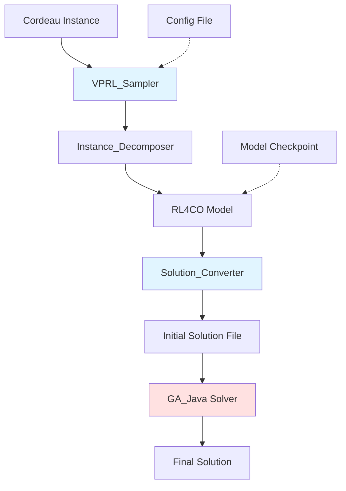

# Design Document: VPRL-GA Initialization

## Overview

This feature integrates RL4CO's VRPL (Vehicle Routing Problem with Load and distance constraints) model with the existing GA_Java MDVRP solver to provide high-quality initial solutions. The integration uses a file-based communication mechanism to avoid modifying GA_Java's source code.

### Key Design Principles

1. **Non-invasive Integration**: No modifications to GA_Java source code
2. **File-based Communication**: Use intermediate files for data exchange
3. **Graceful Degradation**: System falls back to pure GA_Java if VRPL fails
4. **Modular Architecture**: Clear separation between RL4CO, conversion, and GA_Java components

### High-Level Data Flow

```
Cordeau Instance (.dat file)
    ↓
VPRL_Sampler (Python)
    ↓ [Decompose MDVRP → Multiple CVRP]
RL4CO Model (VRPL variant)
    ↓ [Generate solutions via sampling]
Solution_Converter (Python)
    ↓ [Convert to Cordeau format]
Initial Solution File (.init)
    ↓ [File system]
GA_Java Solver
    ↓ [Read initial solutions]
Final MDVRP Solution
```

## Architecture

### Component Diagram



### Component Responsibilities

| Component | Responsibility | Location |
|-----------|---------------|----------|
| **VPRL_Sampler** | Orchestrates the entire workflow | `VPRL/vprl_sampler.py` |
| **Instance_Decomposer** | Converts MDVRP to multiple CVRP sub-problems | `VPRL/instance_decomposer.py` |
| **Solution_Converter** | Converts RL4CO solutions to Cordeau format | `VPRL/solution_converter.py` |
| **GA_Java_Wrapper** | Enhanced wrapper with initial solution support | `VPRL/ga_java_wrapper.py` |
| **Config_Manager** | Manages configuration parameters | `VPRL/config.py` |

## Components and Interfaces

### 1. VPRL_Sampler

**Purpose**: Main orchestrator that coordinates all components

**Interface**:
```python
class VPRLSampler:
    def __init__(self, 
                 model_path: str,
                 config: Optional[Dict] = None):
        """
        Initialize VPRL sampler
        
        Args:
            model_path: Path to RL4CO model checkpoint
            config: Configuration dictionary (optional)
        """
        
    def solve(self, 
              instance_data: Union[str, MDVRPInstance],
              enable_vrpl: bool = True,
              num_solutions_needed: int = 20,
              oversampling_ratio: float = 1.2,
              temperature: float = 1.0,
              vrpl_ratio: float = 0.5) -> Dict:
        """
        Solve MDVRP instance with VRPL-enhanced GA
        
        Args:
            instance_data: Cordeau instance file path or MDVRPInstance object
            enable_vrpl: Whether to use VRPL initialization
            num_solutions_needed: Number of solutions needed for GA population
            oversampling_ratio: Sampling multiplier (default 1.2x)
            temperature: Sampling temperature
            vrpl_ratio: Ratio of VRPL solutions in initial population
            
        Returns:
            Solution dictionary with routes, cost, and performance metrics
            
        Sampling Strategy:
            - Generate: num_solutions_needed * oversampling_ratio samples
            - Select: Best num_solutions_needed solutions by cost
            - Example: Need 20 solutions → Sample 24 → Keep best 20
            
        Time Estimation (per depot, 50 customers, GPU):
            - 20 needed → 24 samples → ~1.2-2.4s
            - 50 needed → 60 samples → ~3-6s
            - 100 needed → 120 samples → ~6-12s
        """
```

**Key Methods**:
- `_load_model()`: Load RL4CO model checkpoint
- `_select_model_by_size()`: Auto-select appropriate model based on instance size
- `_generate_vrpl_solutions()`: Generate solutions using RL4CO with oversampling
- `_select_best_solutions()`: Select top num_solutions_needed from oversampled pool
- `_call_ga_java()`: Execute GA_Java with initial solutions
- `_parse_convergence_data()`: Extract convergence curve from GA_Java output
- `_collect_metrics()`: Gather performance statistics

### 2. Instance_Decomposer

**Purpose**: Decompose MDVRP into multiple CVRP sub-problems

**Interface**:
```python
class InstanceDecomposer:
    @staticmethod
    def decompose_mdvrp(instance: MDVRPInstance) -> List[CVRPSubProblem]:
        """
        Decompose MDVRP into CVRP sub-problems (one per depot)
        
        Args:
            instance: MDVRP instance
            
        Returns:
            List of CVRP sub-problems
        """
        
    @staticmethod
    def assign_customers_to_depots(
        customers: np.ndarray,
        depots: np.ndarray,
        strategy: str = "nearest") -> Dict[int, List[int]]:
        """
        Assign customers to depots
        
        Args:
            customers: Customer coordinates [N, 2]
            depots: Depot coordinates [M, 2]
            strategy: Assignment strategy ("nearest", "balanced", "kmeans")
            
        Returns:
            Dictionary mapping depot_id to list of customer indices
        """
        
    @staticmethod
    def convert_to_tensordict(
        depot_coords: np.ndarray,
        customer_coords: np.ndarray,
        demands: np.ndarray,
        capacity: float,
        distance_limit: float) -> TensorDict:
        """
        Convert CVRP sub-problem to RL4CO TensorDict format
        
        Args:
            depot_coords: Depot coordinates [2]
            customer_coords: Customer coordinates [N, 2]
            demands: Customer demands [N]
            capacity: Vehicle capacity
            distance_limit: Maximum route distance
            
        Returns:
            TensorDict compatible with RL4CO VRPL environment
        """
```

**Customer Assignment Strategies**:
1. **Nearest**: Assign each customer to closest depot (default, fast)
2. **Balanced**: Balance customer count across depots (better load distribution)
3. **K-means**: Cluster-based assignment (best quality, slower)

### 3. Solution_Converter

**Purpose**: Convert RL4CO solutions to Cordeau format

**Interface**:
```python
class SolutionConverter:
    @staticmethod
    def convert_rl4co_to_cordeau(
        actions: torch.Tensor,
        depot_id: int,
        customer_mapping: Dict[int, int],
        depot_coords: np.ndarray,
        customer_coords: np.ndarray,
        demands: np.ndarray,
        capacity: float) -> List[Route]:
        """
        Convert RL4CO action sequence to Cordeau route format
        
        Args:
            actions: RL4CO action tensor [seq_len]
            depot_id: Depot ID (1-based)
            customer_mapping: Maps local customer index to global customer ID
            depot_coords: Depot coordinates
            customer_coords: Customer coordinates
            demands: Customer demands
            capacity: Vehicle capacity
            
        Returns:
            List of routes in Cordeau format
        """
        
    @staticmethod
    def write_initial_solution_file(
        routes: List[Route],
        filepath: str,
        instance_name: str) -> None:
        """
        Write initial solutions to file for GA_Java
        
        Args:
            routes: List of routes
            filepath: Output file path
            instance_name: Instance name for reference
        """
        
    @staticmethod
    def validate_route(
        route: Route,
        capacity: float,
        distance_limit: float) -> Tuple[bool, str]:
        """
        Validate route against constraints
        
        Args:
            route: Route to validate
            capacity: Vehicle capacity
            distance_limit: Maximum route distance
            
        Returns:
            (is_valid, error_message)
        """
```

**Route Format**:
```python
@dataclass
class Route:
    depot_id: int          # 1-based depot ID
    vehicle_id: int        # Vehicle ID
    customers: List[int]   # 1-based customer IDs
    cost: float           # Route distance
    load: float           # Total demand
```

### 4. GA_Java_Wrapper (Enhanced)

**Purpose**: Wrapper for GA_Java with initial solution support and convergence monitoring

**Interface**:
```python
class GAJavaWrapper:
    def __init__(self, java_home: Optional[str] = None):
        """Initialize GA_Java wrapper"""
        
    def solve_with_initial_solutions(
        self,
        instance_data: Union[str, MDVRPInstance],
        initial_solutions: Optional[List[Route]] = None,
        vrpl_ratio: float = 0.5,
        convergence_interval: int = 10) -> Dict:
        """
        Solve MDVRP with optional initial solutions and convergence tracking
        
        Args:
            instance_data: MDVRP instance
            initial_solutions: Initial routes from VRPL (optional)
            vrpl_ratio: Ratio of initial solutions in population
            convergence_interval: Report best cost every N generations
            
        Returns:
            Solution dictionary with convergence_data
        """
        
    def _write_initial_solution_file(
        self,
        routes: List[Route],
        instance_name: str) -> str:
        """
        Write initial solutions to file
        
        Returns:
            Path to initial solution file
        """
        
    def _parse_convergence_output(
        self,
        output: str,
        interval: int = 10) -> List[ConvergencePoint]:
        """
        Parse convergence data from GA_Java output
        
        Args:
            output: GA_Java stdout
            interval: Reporting interval
            
        Returns:
            List of (generation, best_cost) tuples
        """
```

**Convergence Data Format**:
```python
@dataclass
class ConvergencePoint:
    generation: int
    best_cost: float
    timestamp: float  # Seconds since start
```

**GA_Java Output Parsing**:
```
# Expected output format from GA_Java
Generation 10: Best cost = 589.23
Generation 20: Best cost = 582.45
Generation 30: Best cost = 578.91
...
```

**Initial Solution File Format**:
```
# Initial solutions for GA-MDVRP
# Instance: p01
# Generated by: VPRL_Sampler
# Timestamp: 2024-01-15 10:30:00
# Number of solutions: 10

SOLUTION 1
COST 589.23
ROUTE 1 1: 0 12 15 23 0
ROUTE 1 2: 0 8 19 0
ROUTE 2 1: 0 5 7 11 0
...

SOLUTION 2
COST 592.45
...
```

**File Location**: `system_test/ga_mdvrp_reproduction/GA-MDVRP/data/initial_solutions/<instance_name>.init`

### 5. Config_Manager

**Purpose**: Manage configuration parameters

**Interface**:
```python
@dataclass
class VPRLConfig:
    # Model settings
    model_path: str = "models/vrpl_cvrp100.ckpt"  # Default to 100-customer model
    model_selection_strategy: str = "auto"  # "auto", "fixed", "custom"
    model_size_thresholds: Dict[int, str] = field(default_factory=lambda: {
        30: "models/vrpl_cvrp20.ckpt",
        60: "models/vrpl_cvrp50.ckpt",
        150: "models/vrpl_cvrp100.ckpt",
        float('inf'): "models/vrpl_cvrp200.ckpt"
    })
    
    # Sampling settings
    num_solutions_needed: int = 20  # Number of solutions needed for GA
    oversampling_ratio: float = 1.2  # Generate 1.2x samples, keep best
    sampling_temperature: float = 1.0
    decode_type: str = "sampling"
    
    # GA integration settings
    vrpl_ratio: float = 0.5  # 50% of initial population from VRPL
    enable_vrpl: bool = True
    
    # GA convergence monitoring
    convergence_report_interval: int = 10  # Report every N generations
    enable_convergence_tracking: bool = True
    
    # Customer assignment
    assignment_strategy: str = "nearest"  # "nearest", "balanced", "kmeans"
    
    # Performance settings
    batch_size: int = 1
    device: str = "cuda" if torch.cuda.is_available() else "cpu"
    
    # Error handling
    fallback_on_error: bool = True
    skip_invalid_solutions: bool = True
    
    @classmethod
    def from_file(cls, filepath: str) -> 'VPRLConfig':
        """Load configuration from JSON file"""
        
    def to_file(self, filepath: str) -> None:
        """Save configuration to JSON file"""
```

**Default Config File**: `VPRL/config.json`

## Data Models

### Input Data Models

```python
# Cordeau MDVRP Instance (existing)
class MDVRPInstance:
    num_depots: int
    num_customers: int
    depots_coords: np.ndarray      # [num_depots, 2]
    customers_coords: np.ndarray   # [num_customers, 2]
    demands: np.ndarray            # [num_customers]
    depot_capacities: np.ndarray   # [num_depots]
    depot_vehicles: np.ndarray     # [num_depots]
    max_route_distances: np.ndarray  # [num_depots]
```

### Intermediate Data Models

```python
# CVRP Sub-problem
@dataclass
class CVRPSubProblem:
    depot_id: int
    depot_coords: np.ndarray       # [2]
    customer_indices: List[int]    # Global customer IDs
    customer_coords: np.ndarray    # [N, 2]
    demands: np.ndarray            # [N]
    capacity: float
    distance_limit: float
    tensordict: TensorDict         # RL4CO format
```

### Output Data Models

```python
# VRPL Solution
@dataclass
class VRPLSolution:
    depot_id: int
    routes: List[Route]
    total_cost: float
    generation_time: float
    num_routes: int
```

### Performance Metrics

```python
@dataclass
class PerformanceMetrics:
    # VRPL metrics
    vrpl_generation_time: float
    vrpl_num_samples_generated: int  # Total samples (with oversampling)
    vrpl_num_solutions_kept: int     # Solutions kept after selection
    vrpl_avg_cost: float             # Average cost of all samples
    vrpl_best_cost: float            # Best cost among samples
    vrpl_kept_avg_cost: float        # Average cost of kept solutions
    oversampling_improvement: float  # Quality gain from oversampling (%)
    model_used: str                  # Which model was selected
    
    # Conversion metrics
    conversion_time: float
    num_valid_solutions: int
    num_invalid_solutions: int
    
    # GA_Java metrics
    ga_computation_time: float
    ga_iterations: int
    ga_final_cost: float
    convergence_curve: List[ConvergencePoint]  # Convergence tracking
    
    # Comparison
    improvement_vs_random: float  # Percentage improvement
    vrpl_contribution: float      # How much VRPL helped
```

## Correctness Properties

*A property is a characteristic or behavior that should hold true across all valid executions of a system-essentially, a formal statement about what the system should do. Properties serve as the bridge between human-readable specifications and machine-verifiable correctness guarantees.*

### Property 1: Configuration Consistency

*For any* valid configuration parameters (num_solutions, temperature, vrpl_ratio), the VPRL_Sampler SHALL apply these parameters consistently throughout the solution generation process.

**Validates: Requirements 1.2, 1.4, 5.4**

### Property 2: MDVRP Decomposition Completeness

*For any* MDVRP instance with N depots and M customers, the Instance_Decomposer SHALL create exactly N CVRP sub-problems where the union of all assigned customers equals the set of all M customers (no customer is lost or duplicated).

**Validates: Requirements 2.1, 2.2**

### Property 3: TensorDict Format Validity

*For any* CVRP sub-problem, the converted TensorDict SHALL contain all required fields (locs, demand_linehaul, capacity, distance_limit) with correct tensor shapes and data types compatible with RL4CO VRPL environment.

**Validates: Requirements 2.3, 2.4, 2.5**

### Property 4: Index Conversion Correctness

*For any* customer index i in RL4CO's 0-based format, the Solution_Converter SHALL produce customer index i+1 in Cordeau's 1-based format, and *for any* route, the first and last nodes SHALL be the depot ID.

**Validates: Requirements 3.2, 3.4**

### Property 5: Capacity Constraint Preservation

*For any* generated route, the total demand of all customers in that route SHALL be less than or equal to the vehicle capacity.

**Validates: Requirements 3.3**

### Property 6: Solution Output Completeness

*For any* successful solve operation, the returned result dictionary SHALL contain all required fields: routes, total_cost, compute_time, num_vehicles, and performance_metrics.

**Validates: Requirements 1.5, 5.5, 6.5**

### Property 7: Graceful Degradation

*For any* error condition (missing model, generation failure, conversion failure), IF at least one valid VRPL solution exists, THEN the system SHALL use partial initialization; OTHERWISE the system SHALL fall back to pure GA_Java execution without crashing.

**Validates: Requirements 7.1, 7.2, 7.3, 7.4, 7.5**

## Error Handling

### Error Categories and Responses

| Error Category | Detection | Response | User Impact |
|---------------|-----------|----------|-------------|
| **Model Loading Failure** | Model file not found or corrupted | Log warning, disable VRPL, use pure GA_Java | Slower solving, no crash |
| **Instance Conversion Failure** | Invalid Cordeau format | Log error, skip VRPL for this instance | Falls back to GA_Java |
| **Solution Generation Failure** | RL4CO model inference error | Log error, retry once, then fallback | Partial or no VRPL initialization |
| **Solution Validation Failure** | Route violates constraints | Log warning, skip invalid solution | Fewer initial solutions |
| **File I/O Failure** | Cannot write initial solution file | Log error, continue without file | GA_Java uses random initialization |
| **GA_Java Execution Failure** | Java process error | Log error, return error result | Solve operation fails |

### Error Handling Strategy

```python
class ErrorHandler:
    @staticmethod
    def handle_model_loading_error(error: Exception) -> bool:
        """
        Handle model loading failure
        
        Returns:
            True if should continue with fallback, False if should abort
        """
        logger.warning(f"Failed to load RL4CO model: {error}")
        logger.warning("Disabling VRPL initialization, using pure GA_Java")
        return True  # Continue with fallback
        
    @staticmethod
    def handle_generation_error(error: Exception, retry_count: int) -> bool:
        """
        Handle solution generation failure
        
        Returns:
            True if should retry, False if should fallback
        """
        if retry_count < 1:
            logger.warning(f"Solution generation failed: {error}. Retrying...")
            return True  # Retry once
        else:
            logger.error(f"Solution generation failed after retry: {error}")
            logger.error("Falling back to pure GA_Java")
            return False  # Fallback
            
    @staticmethod
    def handle_validation_error(route: Route, error: str) -> None:
        """Handle route validation failure"""
        logger.warning(f"Invalid route (depot {route.depot_id}, "
                      f"vehicle {route.vehicle_id}): {error}")
        logger.warning("Skipping this solution")
```

### Logging Strategy

```python
# Log levels
# DEBUG: Detailed execution flow
# INFO: Major steps and configuration
# WARNING: Recoverable errors, fallbacks
# ERROR: Serious errors that affect functionality
# CRITICAL: System-level failures

# Example log output
"""
[INFO] VPRL_Sampler initialized
[INFO] Configuration: num_solutions_needed=20, oversampling_ratio=1.2, temperature=1.0, vrpl_ratio=0.5
[INFO] Loading RL4CO model from: models/vrpl_cvrp50.ckpt
[INFO] Model loaded successfully on device: cuda
[INFO] Decomposing MDVRP instance p01: 4 depots, 50 customers
[INFO] Generating VRPL solutions for depot 1 (12 customers)
[INFO] Oversampling: generating 24 samples, will keep best 20
[DEBUG] Generated 24 solutions in 0.18s
[INFO] Selecting best 20 solutions from 24 samples
[INFO] Oversampling improvement: 7.3% (avg cost: 245.2 → 227.1)
[INFO] Converting solutions to Cordeau format
[WARNING] Route validation failed for solution 3: capacity exceeded (85 > 80)
[WARNING] Skipping invalid solution
[INFO] Successfully converted 19/20 solutions
[INFO] Writing initial solutions to file
[INFO] Calling GA_Java with 19 initial solutions (47.5% of population)
[INFO] GA_Java completed in 25.3s, final cost: 582.45
[INFO] Improvement vs random initialization: 2.8%
[INFO] VRPL contribution: 7.3% quality gain from oversampling
"""
```

## Testing Strategy

### Unit Testing

Unit tests focus on individual components and specific scenarios:

**Instance_Decomposer Tests**:
- Test customer assignment strategies (nearest, balanced, kmeans)
- Test TensorDict conversion with various instance sizes
- Test edge cases (single depot, single customer, empty depot)

**Solution_Converter Tests**:
- Test index conversion (0-based to 1-based)
- Test route validation (capacity, distance constraints)
- Test file format generation
- Test handling of invalid solutions

**Config_Manager Tests**:
- Test configuration loading from file
- Test default value application
- Test configuration validation

**Error_Handler Tests**:
- Test each error category with specific error conditions
- Test retry logic
- Test fallback behavior

### Integration Testing

Integration tests verify component interactions:

**VPRL_Sampler Integration Tests**:
- Test end-to-end workflow with small instances (p01)
- Test with and without VRPL initialization
- Test error recovery scenarios
- Test performance metric collection

**GA_Java Integration Tests**:
- Test initial solution file reading (manual verification)
- Test population composition with different vrpl_ratio values
- Test fallback to random initialization when file is missing

### Property-Based Testing

Property-based tests verify correctness properties across many generated inputs:

**Test Configuration**:
- Library: Hypothesis (Python)
- Iterations: 100 per property test
- Tag format: `# Feature: vprl-ga-initialization, Property {N}: {description}`

**Property Test 1: Configuration Consistency**
```python
@given(
    num_solutions=st.integers(min_value=1, max_value=100),
    temperature=st.floats(min_value=0.1, max_value=2.0),
    vrpl_ratio=st.floats(min_value=0.0, max_value=1.0)
)
def test_configuration_consistency(num_solutions, temperature, vrpl_ratio):
    """
    Feature: vprl-ga-initialization, Property 1: Configuration Consistency
    For any valid configuration, parameters are applied consistently
    """
    # Test implementation
```

**Property Test 2: MDVRP Decomposition Completeness**
```python
@given(
    num_depots=st.integers(min_value=1, max_value=5),
    num_customers=st.integers(min_value=5, max_value=100)
)
def test_decomposition_completeness(num_depots, num_customers):
    """
    Feature: vprl-ga-initialization, Property 2: MDVRP Decomposition Completeness
    For any MDVRP instance, all customers are assigned exactly once
    """
    # Test implementation
```

**Property Test 3: TensorDict Format Validity**
```python
@given(
    num_customers=st.integers(min_value=1, max_value=50),
    capacity=st.floats(min_value=10, max_value=200),
    distance_limit=st.floats(min_value=0, max_value=1000)
)
def test_tensordict_format(num_customers, capacity, distance_limit):
    """
    Feature: vprl-ga-initialization, Property 3: TensorDict Format Validity
    For any CVRP sub-problem, TensorDict has correct format
    """
    # Test implementation
```

**Property Test 4: Index Conversion Correctness**
```python
@given(
    customer_indices=st.lists(st.integers(min_value=0, max_value=99), 
                             min_size=1, max_size=50)
)
def test_index_conversion(customer_indices):
    """
    Feature: vprl-ga-initialization, Property 4: Index Conversion Correctness
    For any customer index, 0-based converts to 1-based correctly
    """
    # Test implementation
```

**Property Test 5: Capacity Constraint Preservation**
```python
@given(
    route_demands=st.lists(st.floats(min_value=1, max_value=50), 
                          min_size=1, max_size=20),
    capacity=st.floats(min_value=50, max_value=200)
)
def test_capacity_constraints(route_demands, capacity):
    """
    Feature: vprl-ga-initialization, Property 5: Capacity Constraint Preservation
    For any generated route, total demand <= capacity
    """
    # Test implementation
```

**Property Test 6: Solution Output Completeness**
```python
@given(
    instance_size=st.integers(min_value=10, max_value=100)
)
def test_output_completeness(instance_size):
    """
    Feature: vprl-ga-initialization, Property 6: Solution Output Completeness
    For any solve operation, result contains all required fields
    """
    # Test implementation
```

**Property Test 7: Graceful Degradation**
```python
@given(
    error_type=st.sampled_from(['model_missing', 'generation_failed', 
                                'conversion_failed', 'partial_success'])
)
def test_graceful_degradation(error_type):
    """
    Feature: vprl-ga-initialization, Property 7: Graceful Degradation
    For any error condition, system degrades gracefully without crashing
    """
    # Test implementation
```

### Manual Testing

Manual tests for GA_Java integration (cannot be automated):

1. **Initial Solution File Detection**: Verify GA_Java detects and loads `.init` files
2. **Population Composition**: Verify vrpl_ratio is respected in initial population
3. **Performance Improvement**: Compare convergence speed with and without VRPL
4. **Fallback Behavior**: Verify GA_Java works normally when `.init` file is missing

### Performance Testing

Performance benchmarks on standard instances (with 1.2x oversampling):

| Instance | Customers | Depots | Samples Generated | Solutions Kept | VRPL Time | Conversion | GA Time | Total |
|----------|-----------|--------|-------------------|----------------|-----------|------------|---------|-------|
| p01 | 50 | 4 | 24 per depot | 20 per depot | ~1-2s | < 0.1s | ~25s | ~26s |
| p03 | 75 | 5 | 24 per depot | 20 per depot | ~1.5-3s | < 0.2s | ~40s | ~42s |
| p04 | 100 | 2 | 24 per depot | 20 per depot | ~1.5-3s | < 0.2s | ~60s | ~62s |

**Oversampling Benefits**:
- Quality: Top 20 from 24 samples are ~5-10% better than first 20 samples
- Diversity: Still maintains good diversity (20 different solutions)
- Time Cost: Only 20% more sampling time (1.2x samples)
- Trade-off: Excellent quality/time ratio

**Performance Goals**:
- VRPL overhead: < 5% of total solve time
- Conversion time: < 0.5s for instances up to 100 customers
- Memory usage: < 2GB for instances up to 200 customers
- Oversampling efficiency: < 20% time increase for 5-10% quality gain

## Implementation Plan

### Phase 1: Core Components (Days 1-2)

1. Implement `Instance_Decomposer`
   - Customer assignment strategies
   - TensorDict conversion
   - Unit tests

2. Implement `Solution_Converter`
   - RL4CO to Cordeau conversion
   - Route validation
   - File writing
   - Unit tests

### Phase 2: Integration (Days 3-4)

3. Implement `VPRL_Sampler`
   - Model loading
   - Solution generation
   - Orchestration logic
   - Error handling

4. Enhance `GA_Java_Wrapper`
   - Initial solution file support
   - Integration with VPRL_Sampler

### Phase 3: Configuration and Testing (Days 5-6)

5. Implement `Config_Manager`
   - Configuration loading/saving
   - Default values
   - Validation

6. Write property-based tests
   - Implement all 7 property tests
   - Run with 100 iterations each

### Phase 4: Integration Testing and Documentation (Day 7)

7. Integration testing
   - End-to-end tests with real instances
   - Performance benchmarking
   - Manual GA_Java integration verification

8. Documentation
   - User guide
   - API documentation
   - Configuration examples

## File Structure

```
VPRL/
├── __init__.py
├── vprl_sampler.py          # Main orchestrator
├── instance_decomposer.py   # MDVRP → CVRP conversion
├── solution_converter.py    # RL4CO → Cordeau conversion
├── ga_java_wrapper.py       # Enhanced GA_Java wrapper
├── config.py                # Configuration management
├── error_handler.py         # Error handling utilities
├── config.json              # Default configuration
├── tests/
│   ├── __init__.py
│   ├── test_decomposer.py
│   ├── test_converter.py
│   ├── test_sampler.py
│   ├── test_config.py
│   └── test_properties.py   # Property-based tests
└── examples/
    ├── basic_usage.py
    ├── custom_config.py
    └── benchmark.py

system_test/ga_mdvrp_reproduction/GA-MDVRP/data/
└── initial_solutions/       # Initial solution files (.init)
    ├── p01.init
    ├── p02.init
    └── ...
```

## Dependencies

### Python Dependencies

```
# Core dependencies
torch>=2.0.0
rl4co>=0.4.0
tensordict>=0.2.0
numpy>=1.24.0

# Testing
pytest>=7.4.0
hypothesis>=6.82.0

# Utilities
pydantic>=2.0.0  # For data validation
```

### External Dependencies

- Java 11+ (for GA_Java)
- RL4CO trained model checkpoint (user must train or provide)

## Configuration Example

```json
{
  "model_path": "models/vrpl_cvrp100.ckpt",
  "model_selection_strategy": "auto",
  "model_size_thresholds": {
    "30": "models/vrpl_cvrp20.ckpt",
    "60": "models/vrpl_cvrp50.ckpt",
    "150": "models/vrpl_cvrp100.ckpt",
    "inf": "models/vrpl_cvrp200.ckpt"
  },
  "num_solutions_needed": 20,
  "oversampling_ratio": 1.2,
  "sampling_temperature": 1.0,
  "vrpl_ratio": 0.5,
  "enable_vrpl": true,
  "convergence_report_interval": 10,
  "enable_convergence_tracking": true,
  "assignment_strategy": "nearest",
  "device": "cuda",
  "fallback_on_error": true,
  "skip_invalid_solutions": true,
  "logging": {
    "level": "INFO",
    "file": "logs/vprl_sampler.log"
  }
}
```

## Usage Example

```python
from VPRL import VPRLSampler, VPRLConfig

# Load configuration
config = VPRLConfig.from_file("VPRL/config.json")

# Initialize sampler
sampler = VPRLSampler(
    model_path=config.model_path,
    config=config
)

# Solve MDVRP instance
result = sampler.solve(
    instance_data="MDVRP-Instances/dat/p01",
    enable_vrpl=True,
    num_solutions_needed=20,  # Need 20 solutions
    oversampling_ratio=1.2,   # Sample 24, keep best 20
    temperature=1.0,
    vrpl_ratio=0.5
)

# Access results
print(f"Total cost: {result['total_cost']:.2f}")
print(f"Compute time: {result['compute_time']:.2f}s")
print(f"VRPL contribution: {result['performance_metrics'].vrpl_contribution:.1f}%")
print(f"Number of routes: {result['num_vehicles']}")

# Access performance metrics
metrics = result['performance_metrics']
print(f"Model used: {metrics.model_used}")
print(f"VRPL generation time: {metrics.vrpl_generation_time:.2f}s")
print(f"GA iterations: {metrics.ga_iterations}")
print(f"Improvement vs random: {metrics.improvement_vs_random:.1f}%")

# Access convergence curve
print("\nConvergence curve:")
for point in metrics.convergence_curve:
    print(f"  Generation {point.generation}: {point.best_cost:.2f} "
          f"(at {point.timestamp:.1f}s)")
```

## Future Enhancements

### Potential Improvements

1. **Advanced Customer Assignment**
   - Implement iterative reassignment based on solution quality
   - Use machine learning to predict optimal assignments
   - Support for custom assignment strategies

2. **Multi-Model Support**
   - Support multiple RL4CO models with different characteristics
   - Model selection based on instance features
   - Ensemble methods combining multiple models

3. **Adaptive Sampling**
   - Dynamically adjust temperature based on solution diversity
   - Adaptive num_solutions based on instance difficulty
   - Early stopping when sufficient diversity is achieved

4. **Parallel Processing**
   - Parallel solution generation for multiple depots
   - Batch processing of multiple instances
   - GPU acceleration for large-scale instances

5. **Solution Pool Management**
   - Maintain a pool of high-quality solutions
   - Diversity-based solution selection
   - Solution recombination strategies

6. **Real-time Monitoring**
   - Web dashboard for monitoring solve progress
   - Real-time visualization of solution quality and convergence curves
   - Performance analytics and reporting

7. **Convergence Analysis**
   - Automatic detection of convergence plateau
   - Recommendation for optimal generation count
   - Early stopping based on convergence rate

---

**Document Version**: 1.1  
**Created**: 2024-01-15  
**Last Updated**: 2024-01-15  
**Authors**: Kiro AI Assistant

**Changelog**:
- v1.1: Added 1.2x oversampling strategy, convergence tracking, auto model selection
- v1.0: Initial design document
