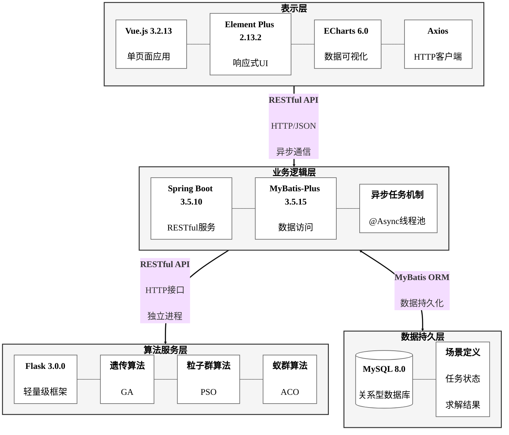

# 图4-1 系统整体架构图

## 架构说明

系统采用前后端分离的三层架构设计，实现了计算密集型算法求解与用户交互逻辑的解耦。

### 1. 表示层 (Presentation Layer)
**核心技术**：Vue.js 3.2.13 + Element Plus 2.13.2 + ECharts 6.0

构建单页面应用，提供响应式用户界面和数据可视化能力。通过Axios客户端与业务逻辑层进行异步通信，避免长时间计算导致的界面阻塞。

**主要功能**：
- MDVRP实例管理（创建、导入、编辑）
- 算法参数配置（GA/PSO/ACO）
- 任务监控与进度展示
- 结果对比分析与可视化

### 2. 业务逻辑层 (Business Logic Layer)
**核心技术**：Spring Boot 3.5.10 + MyBatis-Plus 3.5.15

搭建RESTful服务，实现数据访问和业务逻辑处理。通过@Async注解实现异步任务机制，将算法求解任务提交到独立线程池执行，完成后记录solution供前端查询。

**关键特性**：
- RESTful API设计（场景管理、任务管理、结果查询）
- 异步任务处理（@Async + 线程池）
- 事件驱动架构（@TransactionalEventListener）
- 数据持久化（MyBatis-Plus ORM）

### 3. 算法服务层 (Algorithm Service Layer)
**核心技术**：Flask 3.0.0 + Python

使用轻量级Flask框架封装三种智能优化算法，通过HTTP接口与业务逻辑层通信。作为独立Python进程运行，避免了Java与Python之间的直接集成困难问题。

**算法实现**：
- 遗传算法（GA）：多进程并行计算，加速比5倍
- 粒子群算法（PSO）：单进程优化实现
- 蚁群算法（ACO）：多进程并行计算，加速比5倍

### 4. 数据持久层 (Data Persistence Layer)
**核心技术**：MySQL 8.0

存储场景定义、任务状态、求解结果等关键数据，为业务逻辑层提供持久化支持。

**数据内容**：
- 场景定义：仓库、客户、车辆配置
- 任务状态：PENDING → RUNNING → COMPLETED/FAILED
- 求解结果：路径详情、成本、计算时间

## 架构特点

### 松耦合设计
各层之间通过标准RESTful API通信，前后端完全分离，算法服务独立运行，便于独立开发、测试和部署。

### 异步处理机制
- 前端提交任务后立即返回任务ID，避免HTTP超时
- 后端使用@Async异步执行算法，不阻塞主线程
- 前端轮询任务状态（每2秒），实时更新进度
- 任务状态持久化到数据库，服务重启不丢失

### 计算性能优化
- 算法服务使用Python multiprocessing模块实现多进程并行
- GA和ACO算法在6核CPU上实现3-5倍加速
- 独立进程运行，可根据负载水平扩展

### 可扩展性
- 算法服务层可独立扩展，添加新算法无需修改业务逻辑层
- 组件化设计，功能模块独立，便于维护和升级
- 数据库预留扩展字段，支持未来功能增强

## 通信协议

| 通信路径 | 协议 | 说明 |
|---------|------|------|
| 前端 → 业务逻辑层 | RESTful API (HTTP/JSON) | 异步通信，避免界面阻塞 |
| 业务逻辑层 → 算法服务层 | RESTful API (HTTP/JSON) | 独立进程，解耦Java和Python |
| 业务逻辑层 → 数据库 | MyBatis ORM (JDBC) | 数据持久化，事务管理 |

## 技术栈总结

| 层次 | 技术 | 版本 | 用途 |
|------|------|------|------|
| 表示层 | Vue.js | 3.2.13 | 前端框架 |
| 表示层 | Element Plus | 2.13.2 | UI组件库 |
| 表示层 | ECharts | 6.0 | 数据可视化 |
| 业务逻辑层 | Spring Boot | 3.5.10 | 后端框架 |
| 业务逻辑层 | MyBatis-Plus | 3.5.15 | ORM框架 |
| 算法服务层 | Flask | 3.0.0 | Web框架 |
| 算法服务层 | Python multiprocessing | - | 多进程并行 |
| 数据持久层 | MySQL | 8.0 | 关系型数据库 |
